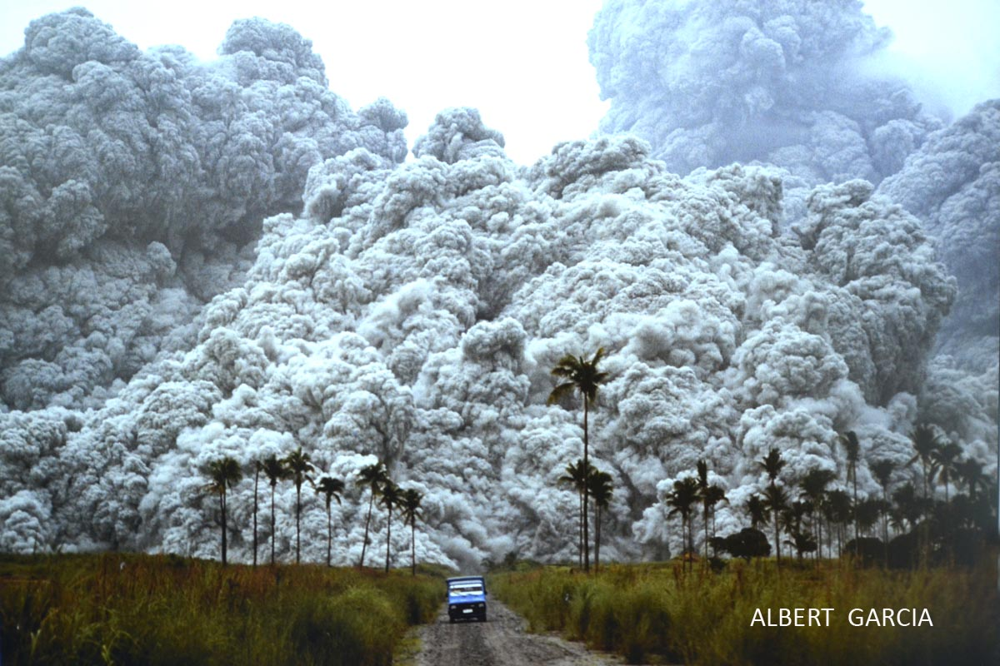
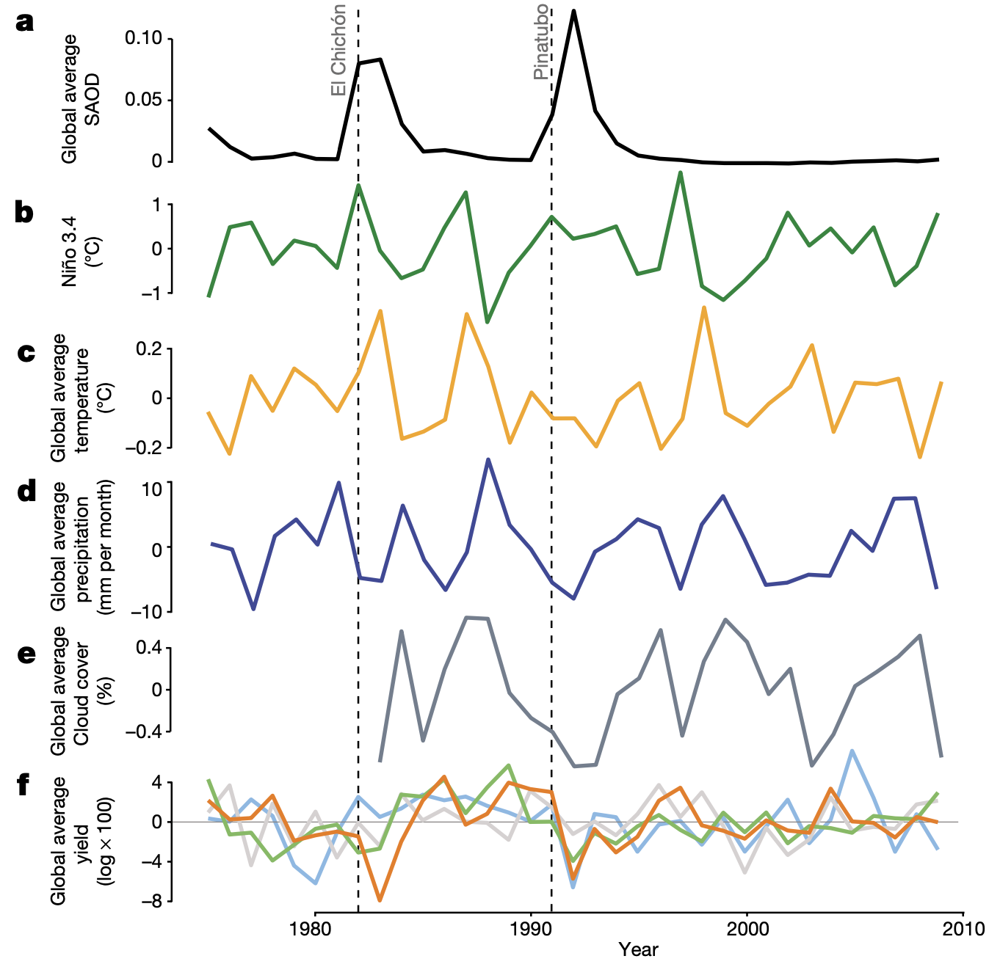
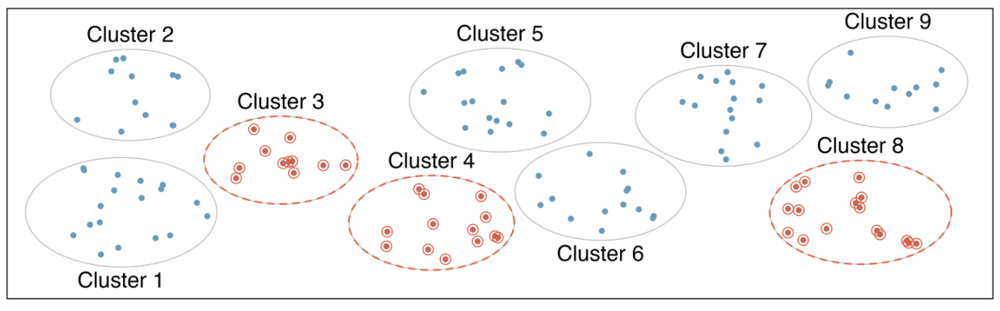

```{r Setup, include = F}
options(htmltools.dir.version = FALSE)
library(pacman)
p_load(leaflet, ggplot2, ggthemes, viridis, dplyr, magrittr, knitr,pagedown)
# Define pink color
red_pink <- "#e64173"
# Notes directory
dir_slides <- "~/Dropbox/Teaching/UCSB/EDS_222/EDS222_code/EDS-222-stats/slides/01-intro/"
# Knitr options
opts_chunk$set(
  comment = "#>",
  fig.align = "center",
  fig.height = 7,
  fig.width = 10.5,
  # dpi = 300,
  # cache = T,
  warning = F,
  message = F
)
```

name: Overview

# Today

## Why are we here? 

What is statistics? Why do we need it as environmental data scientists? 

## Details

Into the syllabus weeds 🌱

## Getting started: Sample vs. population

- What is a sample? What is a population?
- How are samples constructed?
- Study design: how are samples constructed to fit a question?

---

# Why are we we here? 

## Statistics:
The science of **collecting**, **manipulating**, and **analyzing** empirical data

### Statistics enables us to use environmental data to follow the **scientific method** 

```{r, out.width = "40%", echo=FALSE, fig.align='center'}
knitr::include_graphics("The_Scientific_Method.svg")
```
---

# The scientific method: Example

### **Step one:** Make an observation (cool, don't need stats)

#### Ex: When Mt. Pinatubo erupted in 1991, much less sunlight was available for plants...
- 20 Mt of sulfur dioxide $\longrightarrow$ increased stratospheric sulfate aerosols, decreased sunlight reaching Earth's surface

```{r, out.width = "55%", echo=FALSE, fig.align='center'}

```

---

# The scientific method: Example

### **Step two:**  Ask a question (easy, also don't need stats)

#### Ex: I wonder if these aerosols could decrease crop yields?


```{r, out.width = "80%", echo=FALSE, fig.align='center'}
knitr::include_graphics("cropmodel.jpeg")
```

---

# The scientific method: Example

### **Step three:**  Form a hypothesis / testable explanation (sounding somewhat stats-like, but still no pre-req's here)

#### Ex: Did less sunlight from Mt. Pinatubo's aerosols lead to lower crop yields?
```{r, out.width = "45%", echo=FALSE, fig.align='center'}

```

_Source_: Proctor et al. (_Nature_, 2018)
---

# The scientific method: Example

### **Steps four/five:**  Analyze data & test the hypothesis (** !! NEED STATISTICS !! **)

#### Ex: Assemble spatio-temporal dataset, run multivariate linear regression, test statistical significance of regression parameters
```{r, out.width = "60%", echo=FALSE, fig.align='center'}
knitr::include_graphics("proctoretalfig3.png")
```

---

# The scientific method: Example

### **Step six:**  Report conclusions & what they mean for your question

#### Ex: Run simulation to consider the implications for solar radiation management (a form of geo-engineering)
```{r, out.width = "75%", echo=FALSE, fig.align='center'}
knitr::include_graphics("proctoretalfig4.png")
```

---
# Statistics and the scientific method

- Statistics will enable us to **test hypotheses**, **analyze data**, and **draw conclusions** about the world from the process

- Otherwise, we'd be stuck at **observing** and **forming hypotheses**

- ... and we'd have a lot of unanswered empirical questions! 

```{r, out.width = "40%", echo=FALSE, fig.align='center'}
knitr::include_graphics("The_Scientific_Method.svg")
```
---

# This course within MEDS

### This course **is**:
- Designed to build your fundamental statistical toolkit
- Designed to teach you to _apply_ statistics in `R` 
- Designed to show you key spatio-temporal methods that come up frequently in environmental data science
- **Still new!** $\longrightarrow$ We are actively adjusting based on student feedback. Your input will help shape the curriculum!

### This course is **not**:
- A programming class $\longrightarrow$ I will make mistakes. I don't know all the new exciting things. I will learn from you!
- A class in program evaluation/causal inference (👀 EDS 241)
- A class in spatial data analysis (👀 EDS 223)

---
# Syllabus 

Syllabus can always be found on our [course website.](https://tcarleton.github.io/EDS-222-stats/)


---
# COVID-19 

- This course is **in-person**, following UCSB guidelines

- If you are sick (with anything), **please stay home** and just let me know ahead of time. We will get you caught up with notes from classmates, extra office hours, etc.

- If you test positive for COVID-19, stay home for at least 5 days, and follow UCSB protocol. In this case, I will provide a personal Zoom link for you to join, but cannot guarantee all lecture content (e.g., writing on the white board) will be perfectly visible via Zoom

- I will likely make the Tuesday lecture before Thanksgiving remote, as in the past many people have requested this (for health and for travel reasons)

---

# Sample versus population

Consider a potential research question:
> What is the average mercury content in swordfish in the Atlantic Ocean?

--

###Some definitions


- **Population**: The entire target population of interest.
  - Ex: All swordfish in the Atlantic Ocean
  

- **Census**: A data collection including _all_ individuals in the population
  + Ex: Collect mercury data for every single swordfish in the Atlantic Ocean (hard and 💰)
  

---

# Sample versus population

Consider a potential research question:
> What is the average mercury content in swordfish in the Atlantic Ocean?


###Some definitions


- **Sample**: A subset of the target population for which we actually have data
  + Ex: 60 tagged swordfish from a government survey in the Atlantic Ocean
  
---
# Parameters and statistics
<!-- $$\\[1in]$$ --> 

#### Usually we are interested in a numerical summary of the _population_ (e.g., mean, slope, intercept, variance)

- **Parameter**: A numerical summary of the **population**
  + Ex: _average_ mercury content in swordfish in the Atlantic Ocean

- **Statistic**: A numerical summary of the **sample**
  + Ex: _average_ mercury content of the 60 swordfish collected in a government survey in the Atlantic Ocean

---
# Parameters and statistics

#### We use _statistics_ (from a sample) in hopes of learning about _parameters_ (from the population)

- This means that every time you do "statistics", you should be thinking...
  + What is the population of interest?
  + What is my sample?
  + How are they different?
  
---
# All samples are not created equal

From _IMS_: Suppose we want to estimate time to graduation for Duke undergraduates in the last five years using a sample of recent students.
- Q: Who is the population?

Suppose we take a **random** sample (i.e., every individual in the population has the same probability of being selected)

```{r, fig.cap="10 graduates are randomly selected from the population to be included in the sample.", fig.asp = 0.5, fig.width = 8, out.width = "70%", echo=FALSE}
set.seed(1234)
par_og <- par(no.readonly = TRUE) # save original par
par(mar = rep(0, 4))
plot(c(0, 2), c(0, 1.1), type = "n", axes = FALSE, xlab = "", ylab = "")
temp <- seq(0, 2 * pi, 2 * pi / 100)
x <- 0.5 + 0.5 * cos(temp)
y <- 0.5 + 0.5 * sin(temp)
lines(x, y)
s <- matrix(runif(1000), ncol = 2)
S <- matrix(NA, 350, 2)
j <- 0
for (i in 1:nrow(s)) {
  if (sum((s[i, ] - 0.5)^2) < 0.23) {
    j <- j + 1
    S[j, ] <- s[i, ]
  }
}
points(S, col = "steelblue", pch = 20)
text(0.5, 1, "all graduates", pos = 3, cex = 1.3)
set.seed(50)
N <- sample(j, 25)
lines((x - 0.5) / 2 + 1.5, (y - 0.5) / 2 + 0.5, pch = 20)
SS <- (S[N, ] - 0.5) / 2 + 0.5
these <- c(2, 5, 10, 12, 20, 21, 22, 23, 1, 8)
points(SS[these, 1] + 1, SS[these, 2], col = "indianred", pch = 20, cex = 1.5)
text(1.5, 0.75, "sample", pos = 3, cex = 1.3)
for (i in these) {
  arrows(S[N[i], 1], S[N[i], 2],
         SS[i, 1] + 1 - 0.03, SS[i, 2],
         length = 0.08, col = "black", lwd = 1.5
  )
}
par(par_og) # restore original par
```

---
# All samples are not created equal
  
Suppose we ask a nutrition major to pick a few of her friends for the sample.
- What might go wrong here? 

```{r, fig.cap="Asked to pick a sample of graduates, a nutrition major might inadvertently pick a disproportionate number of graduates from health-related majors.", fig.asp = 0.5, fig.width = 8, out.width = "70%", echo=FALSE}
par_og <- par(no.readonly = TRUE) # save original par
par(mar = rep(0, 4))
plot(c(0, 2), c(0, 1.1), type = "n", axes = FALSE, xlab = "", ylab = "")
temp <- seq(0, 2 * pi, 2 * pi / 100)
x <- 0.5 + 0.5 * cos(temp)
y <- 0.5 + 0.5 * sin(temp)
lines(x, y)
s <- matrix(runif(1000), ncol = 2)
S <- matrix(NA, 350, 2)
j <- 0
sub <- rep(FALSE, 1000)
for (i in 1:nrow(s)) {
  if (sum((s[i, ] - 0.5)^2) < 0.23) {
    j <- j + 1
    S[j, ] <- s[i, ]
  }
  if (sum((s[i, ] - c(0.05, 0.18) - 0.5)^2) < 0.07) {
    sub[j] <- TRUE
  }
}
points(S, col = "steelblue", pch = 20)
text(0.5, 1, "all graduates", pos = 3, cex = 1.3)
lines(
  (x - 0.5) * 2 * sqrt(0.07) + 0.55,
  (y - 0.5) * 2 * sqrt(0.07) + 0.68
)
set.seed(7)
N <- sample((1:j)[sub], 25)
lines((x - 0.5) / 2 + 1.5,
      (y - 0.5) / 2 + 0.5,
      pch = 20
)
SS <- (S[N, ] - 0.5) / 2 + 0.5
these <- c(2, 5, 10, 12, 20, 21, 22, 23, 1, 8)
points(SS[these, 1] + 1, SS[these, 2], col = "indianred", pch = 20, cex = 1.5)
text(1.5, 0.75, "sample", pos = 3, cex = 1.3)
for (i in these) {
  arrows(S[N[i], 1], S[N[i], 2],
         SS[i, 1] + 1 - 0.03, SS[i, 2],
         length = 0.08,
         col = "black",
         lwd = 1.5
  )
}
rect(0.143, 0.2, 0.952, 0.301,
     border = "#00000000",
     col = "#FFFFFF88"
)
rect(0.236, 0.301, 0.858, 0.403,
     border = "#00000000",
     col = "#FFFFFF88"
)
text(0.55, 0.5 + 0.18 - sqrt(0.07),
     "graduates from\nhealth-related fields",
     pos = 1, cex = 1.3
)
par(par_og) # restore original par
```

---
  
# All samples are not created equal

When a sample is _not_ drawn randomly, it is likely your statistic will be a biased estimate of the population parameter

Some other examples of biased sampling:

- **Systematic non-response** (e.g., only people from a certain group respond to the phone survey)

- **Convenience sampling** (e.g., biologists only take forest transects near the edge of a large forested area)  

---

# All samples are not created equal
Under-represented groups may be particularly misrepresented due to improper sampling

- Rolf et al., ["Representation Matters"](https://arxiv.org/abs/2103.03399)
  + Show the value of diverse samples for training machine learning algorithms 
  
- Buolamwini et al., ["Gender shades"](http://gendershades.org/)
  + Facial analysis benchmark datasets (i.e., samples) are overwhelmingly white, leading to misclassification for darker-skinned subjects

---

# Four (random) sampling strategies

Nearly all statistical methods are based on assumptions of randomness. If data are not collected randomly from the population, estimates are likely to be biased. 

### Strategy 1: Simple random sampling

- As simple as it sounds!
- To consider for later classes: What problems might arise if your (simple random) sample is small?

```{r, out.width = "90%", echo=FALSE, fig.align='center', fig.cap="Source: IMS"}
knitr::include_graphics("simplerand_sample.png")
```

---

# Four (random) sampling strategies

### Strategy 2: Stratified sampling

- More complex to analyze sample to construct estimates of population parameters (but still possible)
- Helpful when individuals within a strata are quite similar
- Used often as a method to reduce "noise" in your data (we'll discuss this later)

```{r, out.width = "100%", echo=FALSE, fig.align='center', fig.cap="Source: IMS"}
knitr::include_graphics("stratified_sample.png")
```

---

# Four (random) sampling strategies

### Strategy 3: Cluster random sampling

- Helpful when individuals within a cluster are quite _different_ from one another
- Used often when costs of data collection are high per cluster (e.g., Demographic and Health Surveys)
- Also more complex to estimate population parameters

```{r, out.width = "90%", echo=FALSE, fig.align='center', fig.cap="Source: IMS"}

```

---

# Four (random) sampling strategies


### Strategy 4: Multi-stage sampling

- Very similar to cluster sampling, just take fewer samples (randomly)

```{r, out.width = "100%", echo=FALSE, fig.align='center', fig.cap="Source: IMS"}
knitr::include_graphics("clusterrand_sample.png")
```

---
# Study design

#### When we conduct statistical analyses, where do our samples come from?

- **Experimental** studies
  + Sample is collected to fit the study's needs
  
- **Observational** studies
  + Sample exists, design your study to make best use of available data

--

#### In both cases, the researcher generally aims to _causally_ identify a population parameter

- Ex: What is the effect of increased atmospheric aerosols on crop yields? (Proctor et al., 2018)
- Ex: What is the effect of a vaccine booster shot on the risk of COVID-19 hospitalization?
- **You will talk a lot more about this in EDS 241!**

---
# [Very] short foray into study design

```{r sun-causes-cancer, echo=FALSE, out.width = "60%", fig.asp = 0.4}
par_og <- par(no.readonly = TRUE) # save original par
par(mar = rep(0, 4))
plot(c(-0.05, 1.2),
     c(0.39, 1),
     type = 'n',
     axes = FALSE)
text(0.59, 0.89, 'sun exposure', cex = 1)
rect(0.4, 0.8, 0.78, 1)
text(0.3, 0.49, 'use sunscreen', cex = 1)
rect(0.1, 0.4, 0.48, 0.6)
arrows(0.49, 0.78, 0.38, 0.62,
       length = 0.08, lwd = 1.5)
text(0.87, 0.5, 'skin cancer', cex = 1)
rect(0.71,0.4, 1.01, 0.6)
arrows(0.67, 0.78, 0.8, 0.62,
       length = 0.08, lwd = 1.5)
arrows(0.5, 0.5, 0.69, 0.5,
       length = 0.08, col = "gray")
text(0.595, 0.565, "?",
     cex = 1.5, col = "gray")
par(par_og) # restore original par
```

> Q: Does sunscreen lower risk of skin cancer?

- Experiment 
  + Randomly sample 50% of individuals and assign them the sunscreen "treatment", require the other 50% to wear no sunscreen
  + Follow individuals for 20 years, compare cancer outcomes
  
---
# [Very] short foray into study design

```{r sun-causes-cancer2, echo=FALSE, out.width = "60%", fig.asp = 0.4}
par_og <- par(no.readonly = TRUE) # save original par
par(mar = rep(0, 4))
plot(c(-0.05, 1.2),
     c(0.39, 1),
     type = 'n',
     axes = FALSE)
text(0.59, 0.89, 'sun exposure', cex = 1)
rect(0.4, 0.8, 0.78, 1)
text(0.3, 0.49, 'use sunscreen', cex = 1)
rect(0.1, 0.4, 0.48, 0.6)
arrows(0.49, 0.78, 0.38, 0.62,
       length = 0.08, lwd = 1.5)
text(0.87, 0.5, 'skin cancer', cex = 1)
rect(0.71,0.4, 1.01, 0.6)
arrows(0.67, 0.78, 0.8, 0.62,
       length = 0.08, lwd = 1.5)
arrows(0.5, 0.5, 0.69, 0.5,
       length = 0.08, col = "gray")
text(0.595, 0.565, "?",
     cex = 1.5, col = "gray")
par(par_og) # restore original par
```

> Q: Does sunscreen lower risk of skin cancer?

- Observational study
  + Collect data on sunscreen use, skin cancer, and sun exposure
  + Compare cancer rates for individuals with different sunscreen use habits
  
---
# Homework 1 (warmup): Logistics

### Deadline: 10/09, 5pm 

### Where are the data?

- All the data for homework will be on Taylor

- See MEDS summer coursework for a refresher on how to access Taylor, compute on Taylor, and pull data to/from Taylor (**if you are not a MEDS student** please reach out to Sandy and/or Kat Le for help getting access to Taylor)

---
# Homework 1 (warmup): Logistics

### Where should I do computation? 

- All the data we use will be small enough to load and work with _locally_ (e.g., use Cyberduck to pull data down)

- But you're welcome to work on Taylor with an RStudio GUI or Workbench, etc.

- You won't have write access to our class directory, but you do have your own directories on Taylor

- Sandy will walk you through all of this in your first Discussion section

---
# Github in this class

Github will be used in multiple ways in this class:

--

1. My course website is built in git, so you can access any source code you might want (slide materials, lab materials, etc.) from this repo, [#EDS-222-stats](https://github.com/tcarleton/EDS-222-stats). But you won't ever need to interact with this repo if you don't want to. 

--

2. Github Classrooms. All homework assignments will be accessed via GH Classrooms. You will pull the assignment from GH, edit and push your code by the submission deadline, and then pull again once grades are posted to see your grade and to get feedback.

--

3. Final projects. You will submit a Github repo alongside your final project report. We will not be grading this repository, but expect you to keep your project code here.

---
class: center, middle


Slides created via the R package [**xaringan**](https://github.com/yihui/xaringan).

---
exclude: true

```{R, print pdfs, echo = F, eval = F}
pagedown::chrome_print(
  input = "01-intro.html",
  output = "01-intro.pdf",
  timeout = 60
)
```
