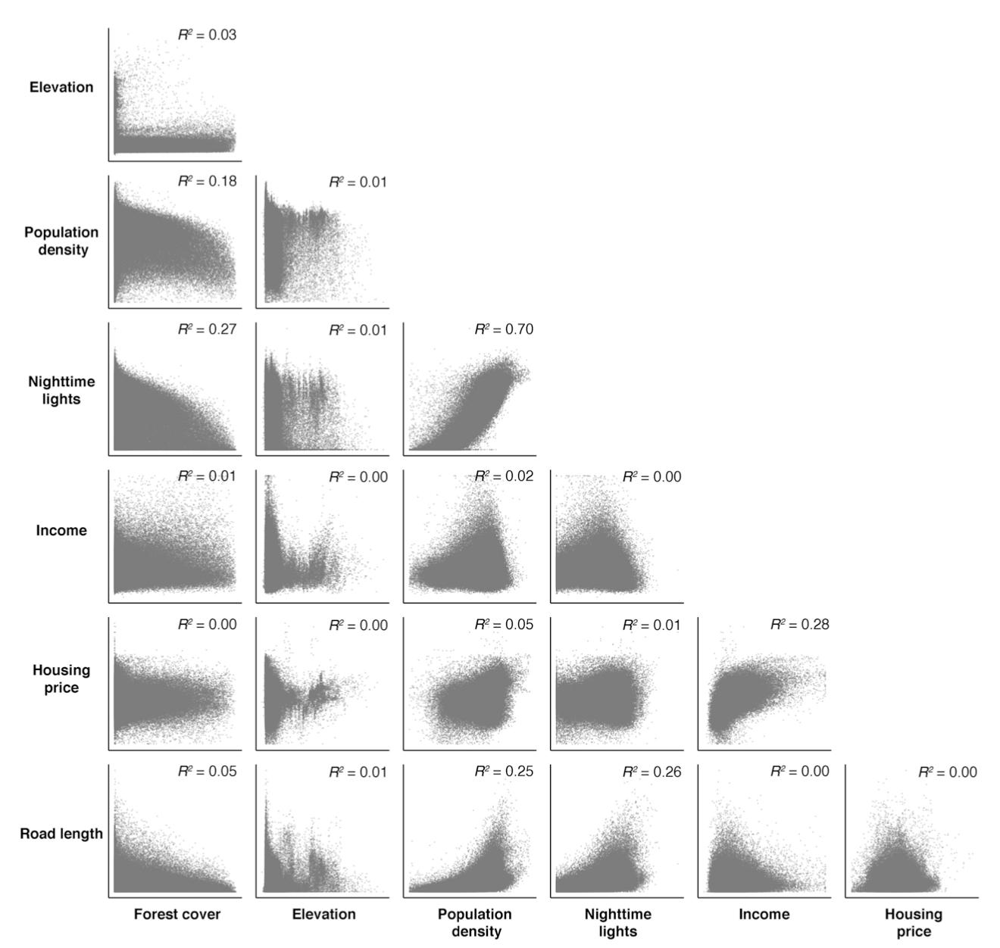

```{r Setup, include = F}
options(htmltools.dir.version = FALSE)
library(pacman)
p_load(leaflet, ggplot2, ggthemes, viridis, dplyr, magrittr, knitr,pagedown,cowplot,latex2exp,parallel,gg3D,xtable)
# Define pink color
red_pink <- "#e64173"
# Notes directory
dir_slides <- "~/Dropbox/Teaching/UCSB/EDS_222/EDS222_code/EDS-222-stats/slides/05-multiplereg/"
# Knitr options
opts_chunk$set(
  comment = "#>",
  fig.align = "center",
  fig.height = 7,
  fig.width = 10.5,
  # dpi = 300,
  # cache = T,
  warning = F,
  message = F,
  dev = "svg"
)
# A blank theme for ggplot
theme_empty <- theme_bw() + theme(
  line = element_blank(),
  rect = element_blank(),
  strip.text = element_blank(),
  axis.text = element_blank(),
  plot.title = element_blank(),
  axis.title = element_blank(),
  plot.margin = structure(c(0, 0, -1, -1), unit = "lines", valid.unit = 3L, class = "unit"),
  legend.position = "none"
)
theme_simple <- theme_bw() + theme(
  line = element_blank(),
  panel.grid = element_blank(),
  rect = element_blank(),
  strip.text = element_blank(),
  axis.text.x = element_text(size = 14),
  axis.text.y = element_blank(),
  axis.ticks = element_blank(),
  plot.title = element_blank(),
  axis.title = element_blank(),
  # plot.margin = structure(c(0, 0, -1, -1), unit = "lines", valid.unit = 3L, class = "unit"),
  legend.position = "none"
)
```


# Announcements/check-in

- Midterm review: In Discussion Section this week and in office hours any time

- Extra study resources on our [Resources page](https://tcarleton.github.io/EDS-222-stats/resources.html)
  + Answer key to practice questions
  + Example of testing OLS assumptions  
  + Derivation of omitted variables bias 

- Moving office hours this week for the Mantell Symposium in EJ and Conservation Innovation (please reach out if this is a problem - happy to add time to meet with you as needed)
  
- Assignment 3: Posted 10/24 **alongside answer key**. Grading will be pass/fail, due 11/7 at 5pm

---
# Midterm Exam

## Two parts:

--

**Part 1: Short answer questions (~3)**

  + Focus on definitions of key concepts
  
  + You should know key definitions (e.g., expectation/mean, median, variance, $R^2$, OLS slope and intercept formulas for simple linear regression)
  
  + You do not need to memorize math rules (e.g., $var(ax+b)=a^2var(x)$)
  
  + Be able to interpret probability distributions, scatter plots, Q-Q plots, boxplots, linear regression output (not $p$-values or $t$-statistics)

---
# Midterm Exam

## Two parts:

**Part 2: Long answer questions (~2)**

  + Each question poses a data science problem and walks you through a set of analysis steps
  
  + Very similar to assignments but focused on interpretation of existing code and output
  
  + May include some minimal pseudo-coding

---
name: Overview

# Today

#### Model fit in multiple regression
Nonlinear relationships in linear models, adjusted $R^2$

--

#### Interaction effects
Implementation and interpretation

--

#### Multicollinearity
Problems and (some) solutions

---

layout: false
class: clear, middle, inverse
# Model fit in multiple regression

---
# Nonlinear transformations

- Our linearity assumption requires that **parameters enter linearly** (_i.e._, the $\beta_k$ multiplied by variables)
- We allow nonlinear relationships between $y$ and the explanatory variables $x$.

**Example: Polynomials**

$$y_i = \beta_0 + \beta_1 x_i + \beta_2 x_i^2 + u_i$$

$$y_i = \beta_0 + \beta_1 x_i + \beta_2 x_i^2 + \beta_3 x_i^3 + u_i$$

$$y_i = \beta_0 + \beta_1 x_i + \beta_2 x_i^2 + \beta_3 x_i^3 + \beta_4 x_i^4 + u_i$$
---
# Polynomials

- Consider the relationship between **temperature** and **harmful algal blooms** (this is a [real thing!](https://www.epa.gov/nutrientpollution/climate-change-and-harmful-algal-blooms#:~:text=Warmer%20temperatures%20prevent%20water%20from,warmer%20and%20promoting%20more%20blooms.)).

--

- Suppose we sampled many coastal locations across the US, and measured the total surface water area at each site that had blooms present. 

--

- Perhaps we have scientific evidence to suggest there is a nonlinear effect of temperature on extent of the blooms. 

--

- We might want to estimate the following model:

$$ area_i = \beta_0 + \beta_1 temperature_i + \beta_2 temperature_i^2 + u_i$$
---
# Polynomials

$$ area_i = \beta_0 + \beta_1 temperature_i + \beta_2 temperature_i^2 + u_i$$

```{R, polys, dev = "svg", fig.height = 6, echo = F}
# Set seed
set.seed(1235)
# Sample size
n <- 1e3
# Generate data
blooms_df <- tibble(
  temp = runif(n, 0, 3),
  # y = 1 + x + x^2 + x^3 + x^4 + 0.5 * x^5 + rnorm(n, mean = 0, sd = 6)
  area = 0.5*temp + 2*temp^2 + rnorm(n, mean = 0, sd=3)
)
# Plot
ggplot(data = blooms_df, aes(x = temp, y = area)) +
  geom_point(size = 2.5, color = "darkslategrey", alpha = 1) +
  labs(x="temperature (degrees C)", y = "bloom area (hectares)") + 
  theme_bw() + 
  theme(
    line = element_blank(),
  panel.grid = element_blank(),
  rect = element_blank(),
  strip.text = element_blank(),
  axis.text.x = element_blank(),
  axis.text.y = element_blank(),
  axis.title = element_text(size=18,face="bold"),
  plot.title = element_blank(),
  legend.position = "none")
```
---
# Polynomials

Estimating polynomial regressions in `R`, option 1:
```{r, echo = T}
blooms_df = blooms_df %>% mutate(temp2 = temp^2)
summary(lm(area~temp+temp2, data=blooms_df))
```

---
# Polynomials

Estimating polynomial regressions in `R`, option 2:
```{r, echo = T}
summary(lm(area~temp+I(temp^2), data=blooms_df))
```
---
# Polynomials

Watch out! Some things are not intuitive:
```{r, echo = T}
summary(lm(area~poly(temp,2), data=blooms_df))
```

---
# Polynomials

Watch out! Some things are not intuitive (need `raw=TRUE` for coefficients to be interpretable -- see helpful Stack Overflow on this [here](https://stackoverflow.com/questions/19484053/what-does-the-r-function-poly-really-do)):
```{r, echo = T}
summary(lm(area~poly(temp,2, raw=TRUE), data=blooms_df))
```

---
# Polynomials
```{r, echo = F}
lm(area ~ temp + I(temp^2), data = blooms_df) %>%
  summary() %>%
  xtable() %>%
  kable()
```

--

How do we interpret these coefficients?

- Intercept: Predicted area of bloom when temperature = 0 degrees C

--

- $\hat\beta_1$ (coeff. on $temp$) and $\hat\beta_2$ (coeff. on $temp^2$)... ???  

--

Go back to Algebra II (see [here](http://www.abcte.org/files/previews/math/s4_p2.html) for a refresher): $y=ax^2 + bx + c$. $a$ tells you whether the U-shape faces up or down, and how narrow or wide it is; $b$ tells you whether the U-shape shifts left or right away from the $y$-axis; $c$ simply shifts the U-shape up or down.

---
# Polynomials

**Don't worry about the Algebra II if it doesn't feel familiar!**

$$ area_i = \beta_0 + \beta_1 temperature_i + \beta_2 temperature_i^2 + u_i$$

You can always:
- Graph your predicted values using `geom_smooth()` (see previous labs)
- Put your coefficients into an automated grapher function (online or on your Mac)
- Use the regression output directly, along with a little basic math (e.g., predict area at temperature = 15, then at temperature = 16, and take the difference!)

--

**Key insight: effect of an increase in temperature on algal bloom area depends on the baseline level of temperature!** (true for all nonlinear relationships)
---
# Nonlinear transformations

Other examples:

- **Polynomials** and **interactions:** $y_i = \beta_0 + \beta_1 x_{1i} + \beta_2 x_{1i}^2 + \beta_3 x_{2i} + \beta_4 x_{2i}^2 + \beta_5 \left( x_{1i} x_{2i} \right) + u_i$ (more on this today)

- **Exponentials** and **logs:** $\log(y_i) = \beta_0 + \beta_1 x_{1i} + \beta_2 e^{x_{2i}} + u_i$ (more on this next week)

- **Indicators** and **thresholds:** $y_i = \beta_0 + \beta_1 x_{1i} + \beta_2 \, \mathbb{I}(x_{1i} \geq 100) + u_i$

--

In all cases, the effect of a change in $x$ on $y$ will vary depending on your baseline level of $x$. This is not true with linear relationships! 

---
# Nonlinear transformations

**Transformation challenge:** (literally) infinite possibilities. What do we pick?

```{R, transfigurestart, dev = "svg", fig.height = 6.5, echo = F}
# Set seed
set.seed(1235)
# Sample size
n <- 1e3
# Generate data
trans_df <- tibble(
  x = runif(n, 0, 3),
  # y = 1 + x + x^2 + x^3 + x^4 + 0.5 * x^5 + rnorm(n, mean = 0, sd = 6)
  y = 2 * exp(x) + rnorm(n, mean = 0, sd = 6)
)
# Plot
ggplot(data = trans_df, aes(x = x, y = y)) +
geom_point(size = 2.5, color = "darkslategrey", alpha = 0.5) +
theme_empty
```

---
count: false
# Nonlinear transformations

$y_i = \beta_0 + u_i$

```{R, transfigure0, dev = "svg", fig.height = 6.5, echo = F}
# Plot
ggplot(data = trans_df, aes(x = x, y = y)) +
geom_line(stat = "smooth", method = lm, formula = y ~ 1, color = "orange", size = 1.5) +
geom_point(size = 2.5, color = "darkslategrey", alpha = 0.5) +
theme_empty
```
---
count: false
# Nonlinear transformations

$y_i = \beta_0 + \beta_1 x + u_i$

```{R, transfigure1, dev = "svg", fig.height = 6.5, echo = F}
# Plot
ggplot(data = trans_df, aes(x = x, y = y)) +
geom_line(stat = "smooth", method = lm, formula = y ~ 1, color = "orange", size = 1.5, alpha = 0.3) +
geom_line(stat = "smooth", method = lm, formula = y ~ x, color = "orange", size = 1.5) +
geom_point(size = 2.5, color = "darkslategrey", alpha = 0.5) +
theme_empty
```
---
count: false
# Nonlinear transformations

$y_i = \beta_0 + \beta_1 x + \beta_2 x^2 + u_i$

```{R, transfigure2, dev = "svg", fig.height = 6.5, echo = F}
# Plot
ggplot(data = trans_df, aes(x = x, y = y)) +
geom_line(stat = "smooth", method = lm, formula = y ~ 1, color = "orange", size = 1.5, alpha = 0.3) +
geom_line(stat = "smooth", method = lm, formula = y ~ x, color = "orange", size = 1.5, alpha = 0.3) +
geom_line(stat = "smooth", method = lm, formula = y ~ poly(x, 2), color = "orange", size = 1.5) +
geom_point(size = 2.5, color = "darkslategrey", alpha = 0.5) +
theme_empty
```

---
count: false
# Nonlinear transformations

$y_i = \beta_0 + \beta_1 x + \beta_2 x^2 + \beta_3 x^3 + u_i$

```{R, transfigure3, dev = "svg", fig.height = 6.5, echo = F}
# Plot
ggplot(data = trans_df, aes(x = x, y = y)) +
geom_line(stat = "smooth", method = lm, formula = y ~ 1, color = "orange", size = 1.5, alpha = 0.3) +
geom_line(stat = "smooth", method = lm, formula = y ~ x, color = "orange", size = 1.5, alpha = 0.3) +
geom_line(stat = "smooth", method = lm, formula = y ~ poly(x, 2), color = "orange", size = 1.5, alpha = 0.3) +
geom_line(stat = "smooth", method = lm, formula = y ~ poly(x, 3), color = "orange", size = 1.5) +
geom_point(size = 2.5, color = "darkslategrey", alpha = 0.5) +
theme_empty
```
---
count: false
# Nonlinear transformations

$y_i = \beta_0 + \beta_1 x + \beta_2 x^2 + \beta_3 x^3 + \beta_4 x^4 + u_i$

```{R, transfigure4, dev = "svg", fig.height = 6.5, echo = F}
# Plot
ggplot(data = trans_df, aes(x = x, y = y)) +
geom_line(stat = "smooth", method = lm, formula = y ~ 1, color = "orange", size = 1.5, alpha = 0.3) +
geom_line(stat = "smooth", method = lm, formula = y ~ x, color = "orange", size = 1.5, alpha = 0.3) +
geom_line(stat = "smooth", method = lm, formula = y ~ poly(x, 2), color = "orange", size = 1.5, alpha = 0.3) +
geom_line(stat = "smooth", method = lm, formula = y ~ poly(x, 3), color = "orange", size = 1.5, alpha = 0.3) +
geom_line(stat = "smooth", method = lm, formula = y ~ poly(x, 4), color = "orange", size = 1.5) +
geom_point(size = 2.5, color = "darkslategrey", alpha = 0.5) +
theme_empty
```
---
count: false
# Nonlinear transformations


$y_i = \beta_0 + \beta_1 x + \beta_2 x^2 + \beta_3 x^3 + \beta_4 x^4 + \beta_5 x^5 + u_i$

```{R, transfigure5, dev = "svg", fig.height = 6.5, echo = F}
# Plot
ggplot(data = trans_df, aes(x = x, y = y)) +
geom_line(stat = "smooth", method = lm, formula = y ~ 1, color = "orange", size = 1.5, alpha = 0.3) +
geom_line(stat = "smooth", method = lm, formula = y ~ x, color = "orange", size = 1.5, alpha = 0.3) +
geom_line(stat = "smooth", method = lm, formula = y ~ poly(x, 2), color = "orange", size = 1.5, alpha = 0.3) +
geom_line(stat = "smooth", method = lm, formula = y ~ poly(x, 3), color = "orange", size = 1.5, alpha = 0.3) +
geom_line(stat = "smooth", method = lm, formula = y ~ poly(x, 4), color = "orange", size = 1.5, alpha = 0.3) +
geom_line(stat = "smooth", method = lm, formula = y ~ poly(x, 5), color = "orange", size = 1.5) +
geom_point(size = 2.5, color = "darkslategrey", alpha = 0.5) +
theme_empty
```

---
count: false
# Nonlinear transformations


**Truth:** $y_i = 2 e^{x} + u_i$

```{R, trans figure 6, dev = "svg", fig.height = 6.5, echo = F}
# Plot
ggplot(data = trans_df, aes(x = x, y = y)) +
geom_line(stat = "smooth", method = lm, formula = y ~ 1, color = "orange", size = 1.5, alpha = 0.3) +
geom_line(stat = "smooth", method = lm, formula = y ~ x, color = "orange", size = 1.5, alpha = 0.3) +
geom_line(stat = "smooth", method = lm, formula = y ~ poly(x, 2), color = "orange", size = 1.5, alpha = 0.3) +
geom_line(stat = "smooth", method = lm, formula = y ~ poly(x, 3), color = "orange", size = 1.5, alpha = 0.3) +
geom_line(stat = "smooth", method = lm, formula = y ~ poly(x, 4), color = "orange", size = 1.5, alpha = 0.3) +
geom_line(stat = "smooth", method = lm, formula = y ~ poly(x, 5), color = "orange", size = 1.5, alpha = 0.3) +
geom_line(stat = "smooth", method = lm, formula = y ~ exp(x), color = red_pink, size = 1.5) +
geom_point(size = 2.5, color = "darkslategrey", alpha = 0.5) +
theme_empty
```

---
# Model fit with multiple regressors

Measures of *goodness of fit* try to analyze how well our model describes (*fits*) the data.

--

**Common measure:** $R^2$ [R-squared] (*a.k.a.* coefficient of determination)

$$ R^2 =  1 - \dfrac{\sum_i \left( y_i - \hat{y}_i \right)^2}{\sum_i \left( y_i - \overline{y} \right)^2} =  1 - \dfrac{\sum_i e_i^2}{\sum_i \left( y_i - \overline{y} \right)^2} $$

Recall $\sum_i \left( y_i - \hat{y}_i \right)^2 = \sum_i e_i^2$ is the "sum of squared errors".

--

$R^2$ literally tells us the share of the variance in $y$ our current models accounts for. Thus $0 \leq R^2 \leq 1$.

---
# Model fit with multiple regressors

**The problem:** As we add variables to our model, $R^2$ *mechanically* increases.

--

**Intuition:** Even if our added variable has _no true relation to_ $y$, it can help lower $e_i$ by fitting to the sampling noise

--


**One solution:**
Penalize for the number of variables, _e.g._, .pink[adjusted] $\color{#e64173}{R^2}$:

$$ \overline{R}^2 = 1 - \dfrac{\sum_i \left( y_i - \hat{y}_i \right)^2/(n-k-1)}{\sum_i \left( y_i - \overline{y} \right)^2/(n-1)} $$
Where $k$ is the number of independent variables in the regression model and $n$ is the total number of observations in your data.

*Note:* Adjusted $R^2$ need not be between 0 and 1.

---

# Model fit with multiple regressors

#### We often use measures of model fit (or model "performance") to help choose a regression model from among multiple possibilities

- Adjusted $R^2$ is just one of **many possible performance metrics**

--

- For example, Akaike Information Criterion (AIC), Bayesian Information Criterion (BIC), Mean Squared Error (MSE), ...

--

- Lots more on the topic of model selection in EDS 232 👀

--

- Don't forget the _theory_ behind your data science! 

---
layout: false
class: clear, middle, inverse
# Interactions
---
# Interactions

Interactions allow the effect of one variable to change based upon the level of another variable.

**Examples**

1. Does the effect of schooling on pay change by race?

2. Does the effect of temperature on ozone change by humidity?

3. Does the effect of UV radiation on cancer change by gender?

4. ??

---
# Interactions

Previously, we considered a model that allowed Toxics Release Inventory (TRI) census tracts and non-TRI tracts to have different average cancer rates, but the model assumed the effect of UV radiation on cancer was the same for everyone:

$$ \text{Cancer}_i = \beta_0 + \beta_1 \, \text{UV}_i + \beta_2 \, \text{TRI}_i + u_i $$

but we can also allow the effect of UV to vary by TRI status:

$$ \text{Cancer}_i = \beta_0 + \beta_1 \, \text{UV}_i + \beta_2 \, \text{TRI}_i + \beta_3 \, \text{UV}_i\times\text{TRI}_i + u_i $$

--

The multiplication of $UV$ by $TRI$ is called an **interaction term** 

---
# Interactions

The model where UV radiation has the same effect for all tracts (**<font color="#e64173">non-TRI</font>** and **<font color="#314f4f">TRI</font>**):

$$ \text{Cancer}_i = \beta_0 + \beta_1 \, \text{UV}_i + \beta_2 \, \text{TRI}_i + u_i $$

```{R, intdata, include = F, cache = T}
# Set seed
set.seed(12345)
# Sample size
n <- 1e3
# Parameters
beta0 <- 20; beta1 <- 0.5; beta2 <- 10; beta3 <- 3
# Dataset
int_df <- tibble(
  male = sample(x = c(F, T), size = n, replace = T),
  school = runif(n, 3, 9) - 3 * male,
  pay = beta0 + beta1 * school + beta2 * male + rnorm(n, sd = 7) + beta3 * male * school
)
reg_noint <- lm(pay ~ school + male, int_df)
reg_int <- lm(pay ~ school + male + school:male, int_df)
```

```{R, intplot1, echo = F, dev = "svg", fig.height = 5.5}
ggplot(data = int_df, aes(x = school, y = pay)) +
geom_point(aes(color = male, shape = male), size = 2.5) +
geom_hline(yintercept = 0) +
geom_vline(xintercept = 0) +
geom_abline(
  intercept = reg_noint$coefficients[1] + reg_noint$coefficients[3],
  slope = reg_noint$coefficients[2],
  color = "darkslategrey", size = 1, alpha = 0.8
) +
geom_abline(
  intercept = reg_noint$coefficients[1],
  slope = reg_noint$coefficients[2],
  color = red_pink, size = 1, alpha = 0.8
) +
xlab("UV radiation (mW/cm^2)") +
ylab("Cancer rate (per 100k)") +
theme_empty +
theme(
  axis.title = element_text(size = 18),
  plot.margin = structure(c(0, 0, 0.1, 0), unit = "lines", valid.unit = 3L, class = "unit"),
) +
scale_color_manual("", values = c(red_pink, "darkslategrey"), labels = c("non-TRI", "TRI")) +
scale_shape_manual("", values = c(16, 1), labels = c("non-TRI", "TRI"))
```

---
# Interactions

The model where UV radiation's effect can differ by TRI status of a tract (**<font color="#e64173">non-TRI</font>** and **<font color="#314f4f">TRI</font>**):

$$ \text{Cancer}_i = \beta_0 + \beta_1 \, \text{UV}_i + \beta_2 \, \text{TRI}_i + \beta_3 \, \text{UV}_i\times\text{TRI}_i + u_i $$

```{R, intplot2, echo = F, dev = "svg", fig.height = 5.5}
ggplot(data = int_df, aes(x = school, y = pay)) +
geom_point(aes(color = male, shape = male), size = 2.5) +
geom_hline(yintercept = 0) +
geom_vline(xintercept = 0) +
geom_abline(
  intercept = reg_noint$coefficients[1] + reg_noint$coefficients[3],
  slope = reg_noint$coefficients[2],
  color = "darkslategrey", size = 0.75, alpha = 0.2
) +
geom_abline(
  intercept = reg_noint$coefficients[1],
  slope = reg_noint$coefficients[2],
  color = red_pink, size = 0.75, alpha = 0.2
) +
geom_abline(
  intercept = reg_int$coefficients[1] + reg_int$coefficients[3],
  slope = reg_int$coefficients[2] + reg_int$coefficients[4],
  color = "darkslategrey", size = 1, alpha = 0.8
) +
geom_abline(
  intercept = reg_int$coefficients[1],
  slope = reg_int$coefficients[2],
  color = red_pink, size = 1, alpha = 0.8
) +
xlab("UV radiation (mW/cm^2)") +
ylab("Cancer rate (per 100k)") +
theme_empty +
theme(
  axis.title = element_text(size = 18),
  plot.margin = structure(c(0, 0, 0.1, 0), unit = "lines", valid.unit = 3L, class = "unit"),
) +
scale_color_manual("", values = c(red_pink, "darkslategrey"), labels = c("non-TRI", "TRI")) +
scale_shape_manual("", values = c(16, 1), labels = c("non-TRI", "TRI"))
```

---
# Interactions

$$ \text{Cancer}_i = \beta_0 + \beta_1 \, \text{UV}_i + \beta_2 \, \text{TRI}_i + \beta_3 \, \text{UV}_i\times\text{TRI}_i + u_i $$
Interpreting coefficients can be a little tricky -- carefully working through the math helps. 

Basic idea: rearrange to uncover a single "slope" term for your variable of interest.

--

- Effect of one more mW/cm^2 of UV radiation on cancer rates:

$$ Cancer_i = \beta_0 + \beta_2 TRI_i + (\beta_1 + \beta_3 TRI_i)\times UV_i + u_i $$
This helps you see that the effect of a one unit increase in $UV$ on $Cancer$ is $\beta_1 + \beta_3 TRI$, so it will vary by $TRI$ status:
  + Effect for $TRI$ tracts = $\beta_1 + \beta_3$
  + Effect for $non-TRI$ tracts = $\beta_1$

---


# Interactions

$$ {y\_i} = \beta\_0 + \beta\_1 {x\_{1i}} + \beta\_2 {x\_{2i}} + \beta\_3 x\_{1i}\times x\_{2i} + u\_i $$

In general, interaction models should be used when **the level of one variable influences the relationship between the outcome and another variables**

--

For example:

- Income changes the relationship between extreme heat and mortality (Carleton et al., 2022)

--

- Gender changes the relationship between air pollution and labor productivity (Graff-Zivin and Neidell, 2021)

--

- Other examples?

---
# Interactions

$$ {y\_i} = \beta\_0 + \beta\_1 {x\_{1i}} + \beta\_2 {x\_{2i}} + \beta\_3 x\_{1i}\times x\_{2i} + u\_i $$


#### Interpreting interaction models means you have to consider the interaction term when computing slopes. 

For example: What is the "slope" of the relationship between $y$ and $x_1$?

--

$$ {y\_i} =  \beta\_0 + (\beta\_1 + \beta\_3 x\_{2i}) {x\_{1i}} + \beta\_2 {x\_{2i}}   + u\_i $$
**Key insight: Higher $x_{i2}$ increases the slope of the relationship between $y$ and $x_1$!** The inverse is also true.

For two continuous random variables, we now have infinitely many slopes for each variable, depending on the level of the other independent variable.

---
# Interactions 

Putting it all in one place...interaction models with two continuous variables:

$$ {y\_i} = \beta\_0 + \beta\_1 {x\_{1i}} + \beta\_2 {x\_{2i}} + \beta\_3 x\_{1i}\times x\_{2i} + u\_i $$

--

- $\beta_3$ is the **difference** in the effect of $x_1$ on $y$ between an individual with $x_2=\ell+1$ and an individual with $x_2=\ell$

--
 
- $\beta_3$ is **also** the difference in the effect of $x_2$ on $y$ between an individual with $x_1=\ell+1$ and an individual with $x_1=\ell$

--
 
- $\beta_0$ is the predicted level of $y$ when **both** $x_1$ and $x_2$ are zero

--
 
- $\beta_1$ is the effect of $x_1$ on $y$ when $x_2$ is zero

--
 
- $\beta_2$ is the effect of $x_2$ on $y$ when $x_1$ is zero

---
# Interactions in R

This will be the focus of Lab on Thursday. As a preview...just like many other aspects of regression analysis, interactions are easy to implement but difficult to carefully interpret in `R`:

--
```{r, echo=FALSE}
mpg = mpg %>% mutate(year = as.factor(year))
```

```{r, echo=TRUE}
summary(lm(hwy ~ displ + year + displ:year, data = mpg))
```

---
layout: false
class: clear, middle, inverse
# Multicollinearity

---
# Multicollinearity

$$ {y\_i} = \beta\_0 + \beta\_1 {x\_{1i}} + \beta\_2 {x\_{2i}} + \cdots + \beta\_k {x\_{ki}} + u\_i $$
### What is it?

- When 2 (_collinearity_) or more (_multicollinearity_) of your independent variables are highly correlated with one another

--

### What is the problem?

- Coefficients change _substantially_ with small changes in independent variables  
- Illogical/unexpected coefficients

---
# Multicollinearity

### Why might it happen?

- Too many independent variables ("overspecified" model)
- Including dummy variable for your reference group 
- True population correlation between variables is high


---
# Multicollinearity

#### Easy check: `ggpairs()`, `pairs()`, etc.

```{r, out.width = "60%", echo=FALSE, fig.align='center'}

```

---
# Multicollinearity

### What to do about it?

- More data helps, if possible

- Check if some variables should be omitted based on theory/conceptual model (e.g., reference group dummy)?

- Eliminate highly correlated variables (ensure your interpretation changes accordingly)
  + E.g., temperature and humidity

---

class: center, middle


Slides created via the R package [**xaringan**](https://github.com/yihui/xaringan).

Some slides and slide components were borrowed from [Ed Rubin's](https://github.com/edrubin/EC421S20) awesome course materials.


```{css, echo = FALSE}
@media print {
  .has-continuation {
    display: block;
  }
}
```
  
---
exclude: true


```{R, print pdfs, echo = F, eval = F}
pagedown::chrome_print(
  input = "05-multiplereg.html",
  output = "05-multiplereg.pdf",
  timeout = 60
)
```

