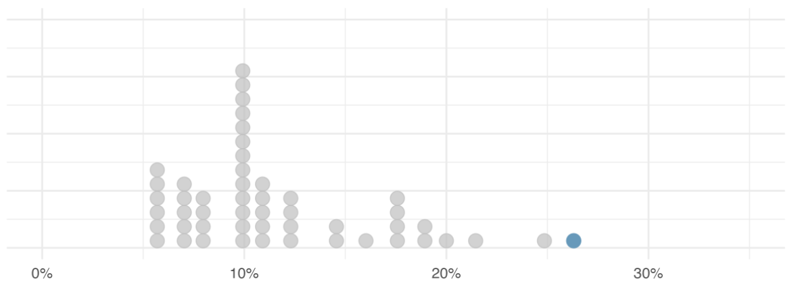
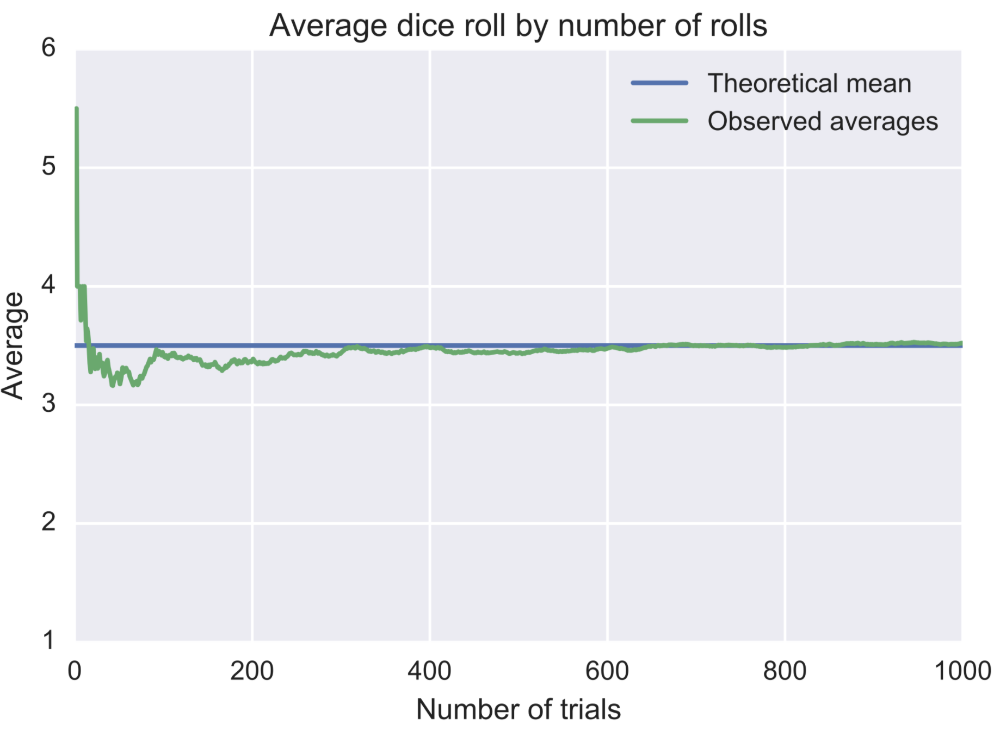

```{r Setup, include = F}
options(htmltools.dir.version = FALSE)
library(pacman)
p_load(leaflet, ggplot2, ggthemes, viridis, dplyr, magrittr, knitr,pagedown,cowplot,latex2exp)
# Define pink color
red_pink <- "#e64173"
# Notes directory
dir_slides <- "~/Dropbox/Teaching/UCSB/EDS_222/EDS222_code/EDS-222-stats/slides/02-summstats/"
# Knitr options
opts_chunk$set(
  comment = "#>",
  fig.align = "center",
  fig.height = 7,
  fig.width = 10.5,
  # dpi = 300,
  # cache = T,
  warning = F,
  message = F,
  dev = "svg"
)
# A blank theme for ggplot
theme_empty <- theme_bw() + theme(
  line = element_blank(),
  rect = element_blank(),
  strip.text = element_blank(),
  axis.text = element_blank(),
  plot.title = element_blank(),
  axis.title = element_blank(),
  plot.margin = structure(c(0, 0, -1, -1), unit = "lines", valid.unit = 3L, class = "unit"),
  legend.position = "none"
)
theme_simple <- theme_bw() + theme(
  line = element_blank(),
  panel.grid = element_blank(),
  rect = element_blank(),
  strip.text = element_blank(),
  axis.text.x = element_text(size = 14),
  axis.text.y = element_blank(),
  axis.ticks = element_blank(),
  plot.title = element_blank(),
  axis.title = element_blank(),
  # plot.margin = structure(c(0, 0, -1, -1), unit = "lines", valid.unit = 3L, class = "unit"),
  legend.position = "none"
)
```


name: Overview

# Today

####  Types of variables
- Categorical, numerical, ordinal, ... 

--

#### Probability density functions
- Definitions, the normal pdf, skew

--

#### Summary statistics
- Central tendency and spread, quantiles, outliers

--

#### Law of large numbers
- How big does my sample need to be? 

--

#### Relationships between variables
- Covariance, correlation

---

layout: false
class: clear, middle, inverse
# Assignment #1 check-in: How's it going?

### Reminder: OH today, 3418 Bren Hall, 3-4pm

---
layout: false
class: clear, middle, inverse
# Types of variables
---

# Types of variables

## Numerical variables
> Object class `numeric` in `R`
- Can take on a wide range of possible values
- Makes sense to add, subtract, multiply, etc.

--
 
- Examples: 
  + Height of the tree canopy across the Amazon
  + Length of Atlantic swordfish
  + Daily average temperature

#### **Discrete** numerical variables take on only a limited set of values, often counts (e.g., population)
#### **Continuous** numerical variables: can take on infinite values within a range (e.g., arsenic concentration in groundwater)


---

# Types of variables

## Numerical variables

```{r, out.width = "70%", echo=FALSE, fig.align='center', fig.cap="Source: Allison Horst"}
knitr::include_graphics("numerical.jpg")
```

---

# Types of variables

## Categorical variables
> Object class `factor` in `R`

- Values correspond to one of a fixed number of categories
- Possible values are called **levels** 

--
 
- Examples: 
  + States of the US
  + Species of tree
  + Age group (e.g., <15, 15-64, 65+) (watch out! continuous numerical data can often be stored as a categorical variable!)

---
# Types of variables

## Categorical variables

#### **Nominal** variables are unordered descriptions
#### **Ordinal** variables are categories with a natural ordering
#### **Binary** variables only take on 0 or 1 

---

# Types of variables

## Categorical variables

```{r, out.width = "85%", echo=FALSE, fig.align='center', fig.cap="Source: Allison Horst"}
knitr::include_graphics("categorical.jpg")
```

---
layout: false
class: clear, middle, inverse
# Probability density functions

---
# Probability density functions

For _continuous_ variables, the **probability density function (p.d.f.)** tells us the probability that a random variable falls within a given range of values. 

Formally: The **p.d.f.** of a continuous variable $X$ with support (i.e., range of possible values) $S$ is an integrable function $f(x)$ satisfying:

--

1. $f(x)$ is positive for all $x$ in $S$

--

2. The area under the curve $f(x)$ over the entire support $S$ is equal to 1: $$ \int_S f(x)dx = 1$$

--

3. The probability that $x$ falls between $A$ and $B$ is: $$ Pr(A\leq x \leq B) = \int_A^B f(x)dx $$

---
# Why isn't this simpler?

> Q: Why can't I just interpret $f(x)$ as the probability that $X=x$?

> A: Because continuous variables have $\infty$ possible values...the probability that your variable $X$ exactly equals $x$ is zero! 

--

### Luckily, for **discrete variables** it _is_ this simple!

For _discrete_ variable $x$ , the **probability mass function (p.m.f.)** $f(x)$ tells us the probability that $X = x$.

Formally: The **p.m.f.** of a discrete variable $X$ with support (i.e., range of possible values) $S$ is a function $f(x)$ satisfying:

1. $P(X=x) = f(x) >0$ for all $x$ in support $S$

2. $\sum_{x\in S} f(x) = 1$

3. $P(A\leq x \leq B) = \sum_{x=A}^{x=B} f(x)$

---
# Probability density functions (visual)

P.d.f.'s help us characterize the distribution of our population. The most common/famous ones get names (e.g., normal, Gamma, $t$,...)

### Let's look at a **normal** distribution*
The probability this normally distributed variable takes on a value between -2 and 0 is shown in pink:

```{R, examplepdf, echo = F, fig.height = 2.8}
# Generate data for density's polygon
tmp <- tibble(x = seq(-4, 4, 0.01), y = dnorm(x))
tmp <- rbind(tmp, tibble(x = seq(4, -4, -0.01), y = 0))
# Plot it
ggplot(data = tmp, aes(x, y)) +
geom_polygon(fill = "grey85") +
geom_polygon(data = tmp %>% filter(between(x, -2, 0)), fill = red_pink) +
geom_hline(yintercept = 0, color = "black") +
theme_simple
```

$^*$This distribution happens to be what's called "standard" normal. We'll get into the weeds later!
---
# Probability density functions (visual)

### Let's look at a **normal** distribution*
The probability this normally distributed variable takes on a value between -2 and 2 is shown in pink:

```{R, examplepdf2, echo = F, fig.height = 2.8}
# Generate data for density's polygon
tmp <- tibble(x = seq(-4, 4, 0.01), y = dnorm(x))
tmp <- rbind(tmp, tibble(x = seq(4, -4, -0.01), y = 0))
# Plot it
ggplot(data = tmp, aes(x, y)) +
geom_polygon(fill = "grey85") +
geom_polygon(data = tmp %>% filter(between(x, -1.96, 1.96)), fill = red_pink) +
geom_hline(yintercept = 0, color = "black") +
theme_simple
```

$^*$Yep, still a "standard" normal. Details later. 
---
# The normal distribution

There are infinite different normal distributions. They all have the following p.d.f.:

$$f(x) =\frac{1}{\sigma\sqrt{2\pi}}e^{-\frac{1}{2}\left(\frac{x-\mu}{\sigma}\right)} $$
where $\mu$ is the mean (i.e., average) and $\sigma$ is the standard deviation (will define soon).

```{r, out.width = "50%", echo=FALSE, fig.align='center'}
knitr::include_graphics("normals.png")
```
#### Many results in statistics rely on the assumption that our data are normally distributed. We will return to this distribution **frequently!**

---
# Shapes of probability distributions

Key terms to describe p.d.f.'s:

1. A distribution can have **skew** (e.g., log-normal)
2. A distribution can have a long **right tail** or **left tail** (e.g., fat-tailed climate sensitivity distributions!)
3. A distribution can be **symmetric**
4. A distribution can be **unimodal**, **bimodal**, or **multimodal**

---
# Shapes of probability distributions

## Skew with a long right tail 
#### (log-normal sample distribution)
```{R, exampleskew, echo = F, fig.height = 3}
# Generate data for density's polygon
set.seed(1298)
samp <- as.data.frame(rlnorm(1000))
  colnames(samp) = "x"
# Plot it
ggplot(data = samp, aes(x=x)) +
  geom_density(fill="grey85") +
  geom_hline(yintercept = 0, color = "black") +
  theme_simple  
```

---
# Shapes of probability distributions

## Uni-, bi-, and multi-modal
#### (How many "peaks" do you see?)
```{R, examplebimodal, echo = F, fig.height = 3}
df_modes <- tibble(
  uni   = rchisq(100, 6),
  bi    = c(rchisq(40, 5.8), rnorm(60, 20, 2)),
  multi =  c(rchisq(40, 3), rnorm(40, 15), rnorm(20, 25, 1.5))
)
p_uni   <- ggplot(df_modes, aes(x = uni)) + 
  geom_histogram(binwidth = 1, fill="grey85") +
  labs(x = NULL, y = NULL) +
  ylim(0, 23) +
  xlim(0, 30) + theme_simple
p_bi    <- ggplot(df_modes, aes(x = bi)) + 
  geom_histogram(binwidth = 1, fill="grey85") +
  labs(x = NULL, y = NULL) +
  ylim(0, 23) +
  xlim(0, 30)+ theme_simple
p_multi <- ggplot(df_modes, aes(x = multi)) + 
  geom_histogram(binwidth = 1, fill="grey85") +
  labs(x = NULL, y = NULL) +
  ylim(0, 23) +
  xlim(0, 30)+ theme_simple
plot_grid(p_uni, p_bi, p_multi, nrow = 1)
```
---
layout: false
class: clear, middle, inverse
# Summary statistics
---

# Describing random variables

A probability density function describes a **population**

As we learned last week, we rarely have a **census** so we rarely can directly describe the p.d.f. itself.

#### Instead, we use _statistics_ from a _sample_ to estimate _parameters_ of the _population_

```{R, examplepdf3, echo = F, fig.height = 3.5}
# Generate data for density's polygon
set.seed(1298)
tmp <- tibble(x = seq(-4, 4, 0.01), y = dnorm(x))
tmp <- rbind(tmp, tibble(x = seq(4, -4, -0.01), y = 0))
samp <- as.data.frame(rnorm(100))
  colnames(samp) = "x"
# Plot it
g = ggplot(data = tmp, aes(x, y)) +
  geom_polygon(fill = "grey85") +
  geom_hline(yintercept = 0, color = "black") +
  theme_simple + ggtitle("population")
s = ggplot(data = samp, aes(x=x)) +
  geom_histogram(fill="grey85") +
  geom_hline(yintercept = 0, color = "black") +
  theme_simple + ggtitle("sample (n=100)")
plot_grid(g,s, labels = list("population", "sample"))
```

---
# Measures of central tendency

### We often begin to describe a distribution using measures of **central tendency** (i.e., measures of the "middle").

Three are most common:
1. **Mean** 
2. **Median**
3. **Mode**

---
# Mean = expected value = average

In a **population**, the mean is defined as: $$\mathrm{E}[X]=\mu=\int_S xf(x)dx$$

--

In our **sample**, we compute the mean as: $$\bar{x}=\frac{1}{n}\sum_{i\in n} x_i$$

#### We use $\bar{x}$ as an *estimate* of the parameter of interest, $\mu$.

```{R, examplemean, echo = F,  fig.height = 2.5}
# Generate data for density's polygon
set.seed(1298)
samp <- as.data.frame(rnorm(100))
  colnames(samp) = "x"
mn = mean(samp$x)
# Plot it
ggplot(data = samp, aes(x=x)) +
  geom_histogram(fill="grey85") +
  geom_hline(yintercept = 0, color = "black") +
  theme_simple + ggtitle("sample (n=100)") + 
  geom_vline(xintercept=mn, color="black", linetype="solid") +
  geom_text(aes(x=0, label="sample mean", y=10), colour="black", fontface="bold")
```
---
# Median = middle value 

In a **population**, the median $m$ is defined as: $$P(X\leq m) = \int_{-\infty}^m f(x)dx = \frac{1}{2} = \int_m^{\infty} f(x)dx = P(X\geq m)$$

--

In our **sample**, we compute the median as: 
- $n$ even? median = mean of the middle two values
- $n$ odd? median = middle value

```{R, examplemedian, echo = F,  fig.height = 2.5}
# Generate data for density's polygon
set.seed(1298)
samp <- as.data.frame(rnorm(100))
  colnames(samp) = "x"
mn = mean(samp$x)
md = median(samp$x)
# Plot it
ggplot(data = samp, aes(x=x)) +
  geom_histogram(fill="grey85") +
  geom_hline(yintercept = 0, color = "black") +
  theme_simple + ggtitle("sample (n=100)") + 
  geom_vline(xintercept=mn, color="black", linetype="solid") +
  geom_text(aes(x=0.3, label="sample mean", y=10), colour="black", fontface="bold") +
  geom_vline(xintercept=md, color="seagreen", linetype="solid") +
  geom_text(aes(x=0.3, label="sample median", y=8), colour="seagreen", fontface="bold")
```
---
# Median and mean are not always close

#### Non-normal distribution $\implies$ median and mean can diverge substantially

```{R, examplemedian2, echo = F, fig.height = 3, fig.width=5.5}
# Generate data for density's polygon
set.seed(1298)
samp <- as.data.frame(rlnorm(1000))
  colnames(samp) = "x"
samp <- samp %>% mutate(x = round(x,digits = 1))
mn = mean(samp$x)
md = median(samp$x)
# Plot it
ggplot(data = samp, aes(x=x)) +
  geom_histogram(fill="grey85", bins=50) +
  geom_hline(yintercept = 0, color = "black") +
  theme_simple + ggtitle("sample (n=100)") + 
  geom_vline(xintercept=mn, color="black", linetype="solid") +
  geom_text(aes(x=5, label="sample mean", y=80), colour="black", fontface="bold") +
  geom_vline(xintercept=md, color="seagreen", linetype="solid") +
  geom_text(aes(x=5, label="sample median", y=100), colour="seagreen", fontface="bold")
```

---
# Mode = most frequent value

### The **mode** is simply the most frequently observed value 

This is much more useful for discrete data (ask yourself why!)

```{R, examplemode, echo = F, fig.height = 3.5, fig.width=6}
# Generate data for density's polygon
set.seed(1298)
samp <- as.data.frame(rlnorm(1000))
  colnames(samp) = "x"
samp <- samp %>% mutate(x = round(x,digits = 1))
mn = mean(samp$x)
md = median(samp$x)
# Function to compute the mode
mode <- function(x) {
   return(as.numeric(names(which.max(table(x)))))
}
mo = mode(samp$x)
# Plot it
ggplot(data = samp, aes(x=x)) +
  geom_histogram(fill="grey85", bins=50) +
  geom_hline(yintercept = 0, color = "black") +
  theme_simple + ggtitle("sample (n=100)") + 
  geom_vline(xintercept=mn, color="black", linetype="solid") +
  geom_text(aes(x=5, label="sample mean", y=100), colour="black", fontface="bold") +
  geom_vline(xintercept=md, color="seagreen", linetype="solid") +
  geom_text(aes(x=5, label="sample median", y=125), colour="seagreen", fontface="bold") +
  geom_vline(xintercept=mo, color="lightcoral", linetype="solid") +
  geom_text(aes(x=5, label="sample mode", y=150), colour="lightcoral", fontface="bold")
```

---
# Measures of spread

### Central tendency only gets us so far...we also need measures of **spread**.

1. **Range** (easy: min to max of your data)
2. **Variance**
3. **Standard deviation**
4. **Quantiles**

---

# Measures of spread: Variance

Answers the question, how far are observations from the mean, on average? 

In the population: $$Var(X) = \mathrm{E}[(X-\mu)^2] = \sigma^2 = \int_{\mathrm S} (x-\mu)^2f(x)dx$$

In the sample: $$ s^2 = \frac{\sum_{i \in n}(x_i-\bar{x})^2}{n-1}$$
> Q: Why do we divide by $n-1$? 

> A: Lots of math to prove it (see [here](https://www.khanacademy.org/math/ap-statistics/summarizing-quantitative-data-ap/more-standard-deviation/v/review-and-intuition-why-we-divide-by-n-1-for-the-unbiased-sample-variance)), but trust me, $s^2$ will be a biased estimate of $\sigma^2$ if you divide by $n$!

#### Units of variance: units of the random variable, _squared_

---
# Measures of spread: Standard deviation 

Just the square root of the variance!  

In the population: $$SD(X) = \sqrt{\mathrm{E}[(X-\mu)^2]} = \sigma = \sqrt{\int_{\mathrm S} (x-\mu)^2f(x)dx}$$

In the sample: $$ s = \sqrt{\frac{1}{n-1}\sum_{i \in n}(x_i-\bar{x})^2}$$

#### Units of standard deviation: units of the random variable

---

# Some helpful rules

$$\mathrm{E}[aX+b] = a\mathrm{E}[X] + b $$
$$\mathrm{E}[X+Y] = \mathrm{E}[X] + \mathrm{E}[Y] $$
$$var(X) = \mathrm{E}[X^2] - (\mathrm{E}[X])^2$$
$$var(aX+b) = a^2var(X)$$

---
# Variance, visually
 

**Pink**: Low variance/standard deviation $\sigma = 1$

**Green**: High variance/standard deviation $\sigma = 2$

```{R, low variance, echo = F, fig.height=4}
d4 <- tibble(x = seq(-7.5, 7.5, 0.01), y = dnorm(x, mean = 0, sd = 1)) %>%
  rbind(., tibble(x = seq(7.5, -7.5, -0.01), y = 0))
d5 <- tibble(x = seq(-7.5, 7.5, 0.01), y = dnorm(x, mean = 0, sd = 2)) %>%
  rbind(., tibble(x = seq(7.5, -7.5, -0.01), y = 0))
ggplot() +
geom_polygon(data = d4, aes(x, y), fill = "lightcoral", alpha = 0.9) +
geom_polygon(data = d5, aes(x, y), fill = "seagreen", alpha = 0.8) +
geom_hline(yintercept = 0, color = "black") +
geom_vline(xintercept = 0, size = 1, linetype = "dashed") +
scale_x_continuous(breaks = 0, labels = TeX("$\\mu$")) +
theme_simple +
theme(axis.text.x = element_text(size = 20))
```

---
# Variance, visually

#### Back to the normal distributions
- Changes in the _mean_ shift the distribution right to left
- Changes in the _standard deviation_ stretch the distribution out (or shrink it in)

```{r, out.width = "70%", echo=FALSE, fig.align='center'}
knitr::include_graphics("normals.png")
```
---
# Measures of spread: Quantiles

### Quantiles are cut points of a probability distribution

In our sample, quantiles are cut points of our sample data

#### How do we compute them?

- We order our data from lowest to highest

- For the $q$-quantile, we divide these ordered data into $q$ equal sized subsamples 
- The value at the edge of the $k$th subsample is the $k$th $q$-quantile
  + This tells you the value below which $\frac{k}{q}$ of the data lie

--

> Question: How many $q$-quantiles are there for any given $q$?

--

> Answer: There are $q-1$ of the $q$-quantiles

---
# Example: The normal distribution

Common quantiles have names you have head of, such as _quartiles_ for $q=4$:

```{r, out.width = "50%", echo=FALSE, fig.align='center', fig.cap="Quartiles of the normal distribution"}
knitr::include_graphics("quantiles_normal.png")
```

**Interpretation:** Q1 = first quartile, Q2 = second quartile, etc. The area below the red curve is the same below Q1 as it is between Q1 and Q2, between Q2 and Q3, and above Q3. 
---
# Common quantiles and interpretation

### Common quantiles have names you have heard of: 
- $q=2$ **Median** tells us the value for which 50% of our sample sits _below_ (and 50% above). This is quantile 0.5 (or 50% quantile)
- $q=3$ **Terciles**: tell us the values for which 33.33% (1st tercile) and 66.66% (2nd tercile) of our sample sits _below_
- $q=4$ **Quartiles**: tell us the values for which 25% (1st quartile), 50% (2nd quartile), and 75% (3rd quartile) of our sample sits _below_
- $q=10$ **Deciles**: tell us the values for which 10% (1st decile), ..., 50% (5th decile), ..., and 90% (9th decile) of our sample sits _below_

--

$q$ The k_th_ $q$-quantile tells us the value for which $\frac{k}{q}\times 100$% of our sample sits _below_


---
# This sounds a lot like percentiles...

### Percentiles are simply quantiles for q=100!

#### We hear about percentiles in daily life more often, and in practice people often use "percentiles" language for the more general term "quantiles". 

#### Examples of percentiles:
- At 5'3", my height is the 40th percentile of the U.S. adult female height distribution $\rightarrow$ 40% of American female adults are shorter than me
- At 24.5 lbs, my son is the 81st percentile of U.S. male 13 month old weight distribution $\rightarrow$ 81% of American male 13 month olds are lighter than my son

> Exercise: Draw approximately where you think the 1st, 10th, 20th, 50th, 80th, 90th and 99th percentiles would be on a normal distribution. 

---
# Quantile-Quantile (Q-Q) Plots

### **Histograms** plot the frequency of our data within bins
  - `geom_histogram()` with `ggplot2` in `R`
  
### **Q-Q plots** plot the quantiles of our data _against_ quantiles of some theoretical distribution
  - `geom_qq()` with `ggplot2` in `R`

> This is helpful if we want to ask things like, are my data approximately normally distributed? 

#### Straight line on a Q-Q plot indicates sample and theoretical distributions match

---
# Q-Q plot: Example

### Annual flow of the river Nile at Aswan, 1871-1970, in 10^8 m^3

.pull-left[
```{R, nilehist, echo = F}
data("Nile")
dfnile = as.data.frame(Nile)
colnames(dfnile) = "flow"
ggplot(data = dfnile) +
geom_histogram(aes(x=flow), fill = "seagreen", alpha = 0.8) +
 xlab("Flow rate") +
  theme_bw() + theme(
  line = element_blank(),
  panel.grid = element_blank(),
  rect = element_blank(),
  strip.text = element_blank(),
  axis.text.x = element_text(size = 20),
  axis.text.y = element_text(size = 20),
  axis.title = element_text(size=20,face="bold"),
  plot.title = element_blank(),
  legend.position = "none")
```
]

--

.pull-right[
```{R, nileqq, echo = F}
data("Nile")
dfnile = as.data.frame(Nile)
colnames(dfnile) = "flow"
ggplot(data = dfnile) +
geom_qq(aes(sample=flow), color = "seagreen", size=6) +
  geom_qq_line(aes(sample=flow), color="grey") +
  xlab("Normal distribution quantiles") +
  ylab("Sample quantiles") + theme_bw() + 
  theme(
    line = element_blank(),
  panel.grid = element_blank(),
  rect = element_blank(),
  strip.text = element_blank(),
  axis.text.x = element_text(size = 20),
  axis.text.y = element_text(size = 20),
  axis.title = element_text(size=20,face="bold"),
  plot.title = element_blank(),
  legend.position = "none")
```
]

---
# Q-Q plot: Example

### Monthly mean relative sunspot numbers, 1749-1983

.pull-left[
```{R, sunspots, echo = F}
data("sunspots")
dfs = as.data.frame(sunspots)
colnames(dfs) = "ssn"
ggplot(data = dfs) +
geom_histogram(aes(x=ssn), fill = "lightcoral", alpha = 0.8, bins=30) +
 xlab("Sunspot relative number") +
  theme_bw() + theme(
  line = element_blank(),
  panel.grid = element_blank(),
  rect = element_blank(),
  strip.text = element_blank(),
  axis.text.x = element_text(size = 20),
  axis.text.y = element_text(size = 20),
  axis.title = element_text(size=20,face="bold"),
  plot.title = element_blank(),
  legend.position = "none")
```
]

--

.pull-right[
```{R, sunspots2, echo = F}
ggplot(data = dfs) +
geom_qq(aes(sample=ssn), color = "lightcoral", size=6) +
  geom_qq_line(aes(sample=ssn), color="grey") +
  xlab("Normal distribution quantiles") +
  ylab("Sample quantiles") + theme_bw() + 
  theme(
    line = element_blank(),
  panel.grid = element_blank(),
  rect = element_blank(),
  strip.text = element_blank(),
  axis.text.x = element_text(size = 20),
  axis.text.y = element_text(size = 20),
  axis.title = element_text(size=20,face="bold"),
  plot.title = element_blank(),
  legend.position = "none")
```
]


> We will continually return to the normal distribution. Always a good idea to check whether your data look normally distributed or not!

---
# Which statistics are robust to outliers?

- Consider a sample of loans from a bank, each with an associated interest rate. 
  + $\bar x = 11.57%$
  + $s=5.05%$
  
- The highest value in the data is somewhat of an outlier, $x_{max} = 26.3%$.

--

```{r, out.width = "80%", echo=FALSE, fig.align='center', fig.cap="Source: IMS, Ch. 5.6"}

```

---
# Which statistics are robust to outliers?

- Consider a sample of loans from a bank, each with an associated interest rate. 
  + $\bar x = 11.57%$
  + $s=5.05%$
  
- The highest value in the data is somewhat of an outlier, $x_{max} = 26.3%$.

- How do summary statistics change if we modify this outlier? 

--

```{r, out.width = "80%", echo=FALSE, fig.align='center', fig.cap="Source: IMS, Ch. 5.6"}
knitr::include_graphics("robusttable.png")
```

---
layout: false
class: clear, middle, inverse
# Law of large numbers
---
# Big data

#### You probably have intuition that a larger sample is better than a smaller one...but why? 

Suppose we have a **random** sample of some size $n$. How well does $\bar x$ approximate $\mu$?  

### Law of large numbers:

$$\bar{x} \rightarrow \mu \hskip2mm \text{as} \hskip2mm n \rightarrow \infty $$
```{r, out.width = "45%", echo=FALSE, fig.align='center', fig.cap="Source: IMS, Ch. 5.6"}

```
---
layout: false
class: clear, middle, inverse
# Relationships between variables
---
# Two random variables

### Often we are interested in the _relationship_ between two (or more) random variables.
E.g., heat waves and heart attacks, nitrogen fertilizer and water pollution

--

```{R, scatter1, echo = F, fig.height=4}
n_p <- 100
# Set the seed
set.seed(12468)
# Generate data
pop_df <- tibble(
  i = 3,
  x = rnorm(n_p, mean = 5, sd = 1.5),
  e = rnorm(n_p, mean = 0, sd = 1),
  y = i + 0.5 * x + e,
  row = rep(1:sqrt(n_p), times = sqrt(n_p)),
  col = rep(1:sqrt(n_p), each = sqrt(n_p)),
)
# Regressions
lm0 <- lm(y ~ x, data = pop_df)

ggplot(data = pop_df, aes(x = x, y = y)) +
geom_point(color = "darkslategray", size = 6) +
  xlab("Number of extreme heat days") +
  ylab("Number of violent crimes") +
   theme_bw() + 
  theme(
    line = element_blank(),
  panel.grid = element_blank(),
  rect = element_blank(),
  strip.text = element_blank(),
  axis.text.x = element_text(size = 16),
  axis.text.y = element_text(size = 16),
  axis.title = element_text(size=18,face="bold"),
  plot.title = element_blank(),
  legend.position = "none")
```

*Note: these are simulated data. But the violence-temperature link is real! See [here](https://www.annualreviews.org/doi/abs/10.1146/annurev-economics-080614-115430) for a summary of research.
---
# Two random variables

### What metrics can we use to characterize the _relationship_ between two variables? 

There are lots. But let's start with...

--

#### 1. Covariance


#### 2. Correlation

```{R, scatter2, echo = F, fig.height=3.5}
ggplot(data = pop_df, aes(x = x, y = y)) +
geom_point(color = "darkslategray", size = 6) +
  xlab("Number of extreme heat days") +
  ylab("Number of violent crimes") +
   theme_bw() + 
  theme(
    line = element_blank(),
  panel.grid = element_blank(),
  rect = element_blank(),
  strip.text = element_blank(),
  axis.text.x = element_text(size = 16),
  axis.text.y = element_text(size = 16),
  axis.title = element_text(size=18,face="bold"),
  plot.title = element_blank(),
  legend.position = "none")
```
---
# Covariance 

#### **Variance** indicates how dispersed a distribution is (average squared deviation from the mean)

--

#### **Covariance** is a measure of the _joint_ distribution of two variables 

- Higher values of $X$ correspond to higher values of $Y$ $\rightarrow$ **positive** covariance
- Higher values of $X$ correspond to lower values of $Y$ $\rightarrow$ **negative** covariance 

--

In the population:
$$Cov(X,Y) = E[(X-\mu_x)(Y-\mu_y)] = E[XY]-\mu_x\mu_y$$

In the sample:
$$s_{xy} = \frac{1}{n-1}\sum_{i=1}^n (x_i - \bar x)(y_i - \bar y)$$

#### The **sign** of $s_{xy}$ tells us the sign of the linear relationship between $X$ and $Y$, but the **magnitude** depends on the units of the variables and is therefore difficult to interpret

---
# Covariance

### Example: positive covariance
```{R, covar1, echo = F, fig.height=5}
set.seed(1248)
x1 = 1:100
y1 = 2*x1 + rnorm(100, mean=2, sd=25)
x2 = x1
y2 = rnorm(100, mean = 0, sd = 100)
x3 = 50*x1
y3 = 1000-x3 + rnorm(100, mean=0, sd=2000)

df = as.data.frame(cbind(x1,x2,x3,y1,y2,y3))
cov1 = round(cov(x1,y1),0)
cov2 = round(cov(x2,y2),0)
cov3 = round(cov(x3,y3),0)

ggplot(data = df, aes(x = x1, y = y1)) +
geom_point(color = "darkslategray", size = 6) +
  annotate(geom="text", x=15, y=200, label=paste0("cov=",cov1),
              color="lightcoral", size=8, fontface="bold") +
   theme_bw() + 
  theme(
    line = element_blank(),
  panel.grid = element_blank(),
  rect = element_blank(),
  strip.text = element_blank(),
  axis.text.x = element_text(size = 16),
  axis.text.y = element_text(size = 16),
  axis.title = element_text(size=18,face="bold"),
  plot.title = element_blank(),
  legend.position = "none")
```

---
# Covariance

### Example: zero covariance

```{R, covar2, echo = F, fig.height=5}

ggplot(data = df, aes(x = x2, y = y2)) +
geom_point(color = "darkslategray", size = 6) +
  annotate(geom="text", x=15, y=200, label=paste0("cov=",cov2),
              color="lightcoral", size=8, fontface="bold") +
   theme_bw() + 
  theme(
    line = element_blank(),
  panel.grid = element_blank(),
  rect = element_blank(),
  strip.text = element_blank(),
  axis.text.x = element_text(size = 16),
  axis.text.y = element_text(size = 16),
  axis.title = element_text(size=18,face="bold"),
  plot.title = element_blank(),
  legend.position = "none")
```


---
# Covariance

### Example: Negative covariance

```{R, covar3, echo = F, fig.height=5}

ggplot(data = df, aes(x = x3, y = y3)) +
geom_point(color = "darkslategray", size = 6) +
  annotate(geom="text", x=4000, y=3000, label=paste0("cov=",cov3),
              color="lightcoral", size=8, fontface="bold") +
   theme_bw() + 
  theme(
    line = element_blank(),
  panel.grid = element_blank(),
  rect = element_blank(),
  strip.text = element_blank(),
  axis.text.x = element_text(size = 16),
  axis.text.y = element_text(size = 16),
  axis.title = element_text(size=18,face="bold"),
  plot.title = element_blank(),
  legend.position = "none")
```

How do I interpret these units?! Hard to compare across these three graphs...

---

# Correlation

#### **Correlation** allows us to normalize covariance into interpretable units
The sign still tells us about the nature of the (linear) relationship between two variables:
  
  - **positive** covariance $\rightarrow$ **positive** correlation (and vice versa)

But now, the magnitude is interpretable:
  
  - Ranges from -1 to 1, with magnitude indicating _strength_ of the relationship

---
# Correlation

#### **Correlation** allows us to normalize covariance into interpretable units  
  
  In the population:
  $$\rho_{X,Y} = corr(X,Y) = \frac{cov(X,Y)}{\sigma_x \sigma_y}$$
  
  In the sample:
  $$r_{x,y} = \frac{s_{x,y}}{s_x s_y} = \frac{1}{(n-1)s_x s_y}\sum_{i=1}^n (x_i - \bar x)(y_i - \bar y)$$
  
---
  
# Correlation
  
### Example: Strong positive correlation

```{R, corr1, echo = F, fig.height=5}

corr1 = round(cor(x1,y1),2)
corr2 = round(cor(x2,y2),2)
corr3 = round(cor(x3,y3),2)

ggplot(data = df, aes(x = x1, y = y1)) +
  geom_point(color = "darkslategray", size = 6) +
  annotate(geom="text", x=15, y=200, label=paste0("corr=",corr1),
           color="lightcoral", size=8, fontface="bold") +
  theme_bw() + 
  theme(
    line = element_blank(),
    panel.grid = element_blank(),
    rect = element_blank(),
    strip.text = element_blank(),
    axis.text.x = element_text(size = 16),
    axis.text.y = element_text(size = 16),
    axis.title = element_text(size=18,face="bold"),
    plot.title = element_blank(),
    legend.position = "none")
```


---
# Correlation
  
### Example: zero correlation
  
```{R, corr2, echo = F, fig.height=5}

ggplot(data = df, aes(x = x2, y = y2)) +
  geom_point(color = "darkslategray", size = 6) +
  annotate(geom="text", x=15, y=200, label=paste0("corr=",corr2),
           color="lightcoral", size=8, fontface="bold") +
  theme_bw() + 
  theme(
    line = element_blank(),
    panel.grid = element_blank(),
    rect = element_blank(),
    strip.text = element_blank(),
    axis.text.x = element_text(size = 16),
    axis.text.y = element_text(size = 16),
    axis.title = element_text(size=18,face="bold"),
    plot.title = element_blank(),
    legend.position = "none")
```

---
# Correlation
  
### Example: Moderate negative correlation
  
```{R, corr3, echo = F, fig.height=5}

ggplot(data = df, aes(x = x3, y = y3)) +
  geom_point(color = "darkslategray", size = 6) +
  annotate(geom="text", x=4000, y=3000, label=paste0("corr=",corr3),
           color="lightcoral", size=8, fontface="bold") +
  theme_bw() + 
  theme(
    line = element_blank(),
    panel.grid = element_blank(),
    rect = element_blank(),
    strip.text = element_blank(),
    axis.text.x = element_text(size = 16),
    axis.title = element_text(size=18,face="bold"),
    plot.title = element_blank(),
    legend.position = "none")
```

---
# Next up

### Summary statistics in `R` (Thursday lab, Assignment 02)

### Linear regression (Next Tuesday)

---

class: center, middle


Slides created via the R package [**xaringan**](https://github.com/yihui/xaringan).

Some slide components were borrowed from [Ed Rubin's](https://github.com/edrubin/EC421S20) awesome course materials.

---
exclude: true

```{R, print pdfs, echo = F, eval = F}
pagedown::chrome_print(
  input = "02-summstats.html",
  output = "02-summstats.pdf",
  timeout = 90
)
```
