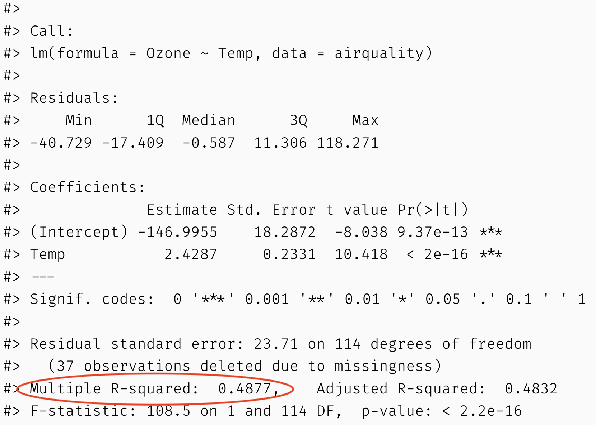

```{r Setup, include = F}
options(htmltools.dir.version = FALSE)
library(pacman)
p_load(leaflet, ggplot2, ggthemes, viridis, dplyr, magrittr, knitr,pagedown,cowplot,latex2exp,parallel,gg3D)
# Define pink color
red_pink <- "#e64173"
# Notes directory
dir_slides <- "~/Dropbox/Teaching/UCSB/EDS_222/EDS222_code/EDS-222-stats/slides/04-ols-contd/"
# Knitr options
opts_chunk$set(
  comment = "#>",
  fig.align = "center",
  fig.height = 7,
  fig.width = 10.5,
  # dpi = 300,
  # cache = T,
  warning = F,
  message = F,
  dev = "svg"
)
# A blank theme for ggplot
theme_empty <- theme_bw() + theme(
  line = element_blank(),
  rect = element_blank(),
  strip.text = element_blank(),
  axis.text = element_blank(),
  plot.title = element_blank(),
  axis.title = element_blank(),
  plot.margin = structure(c(0, 0, -1, -1), unit = "lines", valid.unit = 3L, class = "unit"),
  legend.position = "none"
)
theme_simple <- theme_bw() + theme(
  line = element_blank(),
  panel.grid = element_blank(),
  rect = element_blank(),
  strip.text = element_blank(),
  axis.text.x = element_text(size = 14),
  axis.text.y = element_blank(),
  axis.ticks = element_blank(),
  plot.title = element_blank(),
  axis.title = element_blank(),
  # plot.margin = structure(c(0, 0, -1, -1), unit = "lines", valid.unit = 3L, class = "unit"),
  legend.position = "none"
)
```


# Announcements/check-in

**New office hours location!!** We will now meet in the Pine Room (Bren Hall 3526) for office hours so we have more space.

--

- Assignment #2: Grades and answers by the end of the week

--

- Assignment #3: Posted, due Friday 5pm

--

- Labs and repos: No more .mono[git] for labs, please download directly

--

- Midterm heads up: week after next

--

- Thank you for the feedback on Slack

---
name: Overview

# Today

#### Notes on OLS
- Unit conversions, missing data, outliers

--

#### Measures of model fit
- Coefficient of variation $R^2$

--

#### Categorical variables
- In .mono[R], interpretation

--

#### Multiple linear regression
- Adding independent variables, interpretation of results
- Nonlinearities
- Adjusted $R^2$
- Interaction effects [probably next time]

---

layout: false
class: clear, middle, inverse
# Notes on OLS

---
# Units of X and Y matter

### Original regression (Temperature in degrees F)

```{r,echo=TRUE}
mod <- lm(Ozone ~ Temp, data=airquality)
summary(mod)
```

---
# Units of X and Y matter

### New regression (Temperature in degrees C)

```{r, echo = T}
airquality$TempC <- (airquality$Temp - 32)*5/9
summary(lm(Ozone~TempC, data=airquality))
```

---
# Outliers

Because OLS minimizes the sum of the **squared** errors, outliers can play a large role in our estimates.

**Common responses**

- Remove the outliers from the dataset

- Replace outliers with the 99<sup>th</sup> percentile of their variable (*winsorize*)

- Take the log of the variable (This lowers the leverage of large values -- why?)

- Do nothing. Outliers are not always bad. Some people are "far" from the average. It may not make sense to try to change this variation.

---
# Missing data

Similarly, missing data can affect your results.

.mono[R] doesn't know how to deal with a missing observation.
```{R, examplena}
1 + 2 + 3 + NA + 5
```

If you run a regression<sup>†</sup> with missing values, .mono[R] drops the observations missing those values.

If the observations are missing in a nonrandom way, a random sample may end up nonrandom.

.footnote[
[†]: Or perform almost any operation/function
]

---

layout: false
class: clear, middle, inverse
# Measures of model fit

---
# Measures of model fit

### Goal: quantify how "well" your regression model fits the data

#### General idea: Larger variance in residuals suggests our model isn't very predictive

.pull-left[

```{R, highvar, echo = F, dev = "svg"}
x = 1:100
yh = x + 40*rnorm(100)
yl = x + 5*rnorm(100)
df = tibble(x=x, yh=yh, yl=yl)

ggplot(data = df, aes(x, yh)) +
geom_point(color="darkslategrey", size=6) +
  geom_smooth(method='lm', formula= y~x, color="lightcoral", se=F, size=3) + 
theme_empty
```

]

--

.pull-right[

```{R, lowvar, echo = F, dev = "svg"}
ggplot(data = df, aes(x, yl)) +
geom_point(color="darkslategrey", size=6) +
  geom_smooth(method='lm', formula= y~x, color="lightcoral", se=F, size=3) +
theme_empty
```

]
---
# Coefficient of determination

- We already learned one measure of the strength of a linear relationship: correlation, $r$

--

- In OLS, we often rely on $R^2$, the **coefficient of determination**. In simple linear regression, this is simply the square of the correlation.
- Interpretation of $R^2$: **share of the variance in $y$ that is explained by $x$**

--
$$
SSR = \text{sum of squared residuals} = \sum_i (y_i - \hat y_i)^2 = \sum_i e_i^2 
$$

$$
SST = \text{total sum of squares} = \sum_i (y_i - \bar y)^2 
$$

$$
R^2 = 1 - \frac{SSR}{SST} = 1 - \frac{\sum_i e_i^2}{\sum_i (y_i - \bar y)^2}
$$


---
# Coefficient of determination

$$
R^2 = 1 - \frac{SSR}{SST} = 1 - \frac{\sum_i e_i^2}{\sum_i (y_i - \bar y)^2}
$$
--

- $R^2$ varies between 0 and 1: Perfect model with $e_i=0$ for all $i$ has $R^2=1$. $R^2=0$ if we just guess the mean $\bar y$.

--

- In more complex models, $R^2$ is not the same as the square of the correlation coefficient. You should think of them as related but distinct concepts.

---
# Coefficient of determination

About 49% of the variation in ozone can be explained with temperature alone!

```{r, out.width = "70%", echo=FALSE, fig.align='center'}

```

---
# Coefficient of determination

#### Definition: % of variance in $y$ that is explained by $x$ (and any other independent variables)

--

- Describes a _linear_ relationship between $y$ and $\hat y$
 
--

- Higher $R^2$ does not mean a model is "better" or more appropriate
  + Predictive power is not often the goal of regression analysis (e.g., you may just care about getting $\beta_1$ right)
  + If you are focused on predictive power, many other measures of fit are appropriate (to discuss in machine learning)
  + Always look at your data and residuals! 
  
--

- Like OLS in general, $R^2$ is very sensitive to outliers. Again...always look at your data!

---
# Coefficient of determination 

Here, $R^2=0.94$. Does that mean a linear model is appropriate?


```{R, rsq, echo = F, dev = "svg", fig.height=5}
set.seed(444)
x = 1:100
y = x^2 + 100*rnorm(100)
dfr2 = tibble(x=x, y=y)

ggplot(data = dfr2, aes(x, y)) +
geom_point(color="darkslategrey", size=6) +
  geom_smooth(method='lm', formula= y~x, color="lightcoral", se=F, size=3) + 
theme_empty
```

---
# Coefficient of determination 

Here, $R^2=0$. Does that mean there is no relationship between these variables?


```{R, rsq2, echo = F, dev = "svg", fig.height=5}
set.seed(444)
x = -50:50
y = x^2 + 100*rnorm(100)
dfr2 = tibble(x=x, y=y)

ggplot(data = dfr2, aes(x, y)) +
geom_point(color="darkslategrey", size=6) +
  geom_smooth(method='lm', formula= y~x, color="lightcoral", se=F, size=3) + 
theme_empty
```

---

layout: false
class: clear, middle, inverse
# Indicator/categorical variables

---
# Categorical variables

We have been talking a lot about **numerical** variables in linear regression...
  + Ozone levels
  + Possom tail lengths
  + Temperature and precipitation amounts
  + etc.

--

...but a lot of variables of interest are **categorical**:
  + Male/female
  + Presence/absence of a species
  + In/out of compliance with a pollution standard
  + etc.

--

#### How do we execute and interpret linear regression with categorical data?

---
# Categorical variables

We use **dummy** or **indicator** variables in linear regression to capture the influence of a categorical independent variable (_x_) on a continuous dependent variable (_y_).

--

For example, let _x_ be a categorical variable indicating the gender of an individual. Suppose we are interested in the "gender wage gap", so _y_ is wages. We estimate:

$$y_i = \beta_0 + \beta_1 MALE_i + \varepsilon_i $$
--

###Interpretation [draw it]:
- $MALE_i$ is an **indicator** variable that = 1 when $i$ is male (0 otherwise)
- $\beta_0=$ average wages if $i$ is **not** male
- $\beta_0+\beta_1=$ average wages if $i$ is male
- $\beta_1=$ average _difference_ in wages between males and females

---
# Categorical variables

#### For a categorical variable with two "levels", OLS reports the difference in means across the two groups

```{r, echo=FALSE, fig.height=5.5}
set.seed(444)
male = sample(c(0,1), 100, replace=TRUE) # draw gender
income = male*40000 + rnorm(100, mean = 20000, sd= 20000) # draw income
df = as.data.frame(cbind(male,income)) 
df = df %>% mutate(male = factor(male, levels = c(0,1))) # make gender a factor
df = df %>% rowwise() %>% mutate(income = max(income,0)) # ensure income is nonnegative

ggplot(data=df) +
  geom_point(aes(y=income,x=male, color=male), size=4) + 
  scale_color_discrete() + 
  theme_classic()
  
```

---
# Categorical variables

#### What if I have many categories?
- E.g., species, education level, age group, ...

For example, let _x_ be a categorical variable indicating the species of penguin, and _y_ is body mass. We estimate:

$$y_i = \beta_0 + \beta_1 SPECIES_i + \varepsilon_i $$
Where **species** can be one of:
- Adelie
- Chinstrap
- Gentoo

---
# Categorical variables

```{r, echo=T}
library(palmerpenguins) 
head(penguins)
class(penguins$species)
```

---
# Categorical variables

```{r, echo=T}
summary(lm(body_mass_g ~ species, data = penguins))
```

---
# Categorical variables

When your categorical variable takes on $k$ values, .mono[R] will create dummy variables for $k-1$ values, leaving one as the **reference** group:

```{r, echo=F}
knitr::include_graphics("penguins.png")
```

--

To evaluate the outcome for the reference group, **set the dummy variables equal to zero for all other groups**.

> Q: What is the average body mass of an Adelie species?

> Q: What is the difference in body mass between Chinstrap and Adelie?


---
layout: false
class: clear, middle, inverse
# Multiple linear regression

---

# More explanatory variables

We're moving from **simple linear regression** (one .pink[outcome variable] and one .purple[explanatory variable])

$$ \color{#e64173}{y_i} = \beta_0 + \beta_1 \color{#6A5ACD}{x_i} + u_i $$

--

to the land of **multiple linear regression** (one .pink[outcome variable] and multiple .purple[explanatory variables])

$$ \color{#e64173}{y\_i} = \beta\_0 + \beta\_1 \color{#6A5ACD}{x\_{1i}} + \beta\_2 \color{#6A5ACD}{x\_{2i}} + \cdots + \beta\_k \color{#6A5ACD}{x\_{ki}} + u\_i $$

--

**Why?**
--
 We can better explain the variation in $y$, improve predictions, avoid omitted-variable bias (i.e., second assumption needed for unbiased OLS estimates), ...

---
# More explanatory variables

Multiple linear regression...

$$ \color{#e64173}{y\_i} = \beta\_0 + \beta\_1 \color{#6A5ACD}{x\_{1i}} + \beta\_2 \color{#6A5ACD}{x\_{2i}} + \cdots + \beta\_k \color{#6A5ACD}{x\_{ki}} + u\_i $$
--

... raises many questions:

--

- Which $x$'s should I include? This is the problem of "model selection".

--

- How does my interpretation of $\beta_1$ change?

--

- What if my $x$'s interact with each other? E.g., race and gender, temperature and rainfall.

--

- How do I measure model fit now?

--

**We will dig into each of these here,** and you will see these questions in other MEDS courses

---
# Multiple regression

```{R, gendata, cache = T, include = F}
n <- 1e2
set.seed(1234)
gen_df <- tibble(
  x1 = runif(n = n, min = -3, max = 3),
  x2 = sample(x = c(F, T), size = n, replace = T),
  u  = rnorm(n = n, mean = 0, sd = 1),
  y  = -0.5 + x1 + x2 * 4 + u
)
mean_a <- filter(gen_df, x2 == F)$y %>% mean()
mean_b <- filter(gen_df, x2 == T)$y %>% mean()
gen_df %<>% mutate(y_dm = y - mean_a * (x2 == F) - mean_b * (x2 == T))
```

$y_i = \beta_0 + \beta_1 x_{1i} + \beta_2 x_{2i} + u_i \quad$ $x_1$ is continuous $\quad x_2$ is categorical

--

```{R, multregplot1, dev = "svg", echo = F, fig.height = 6}
ggplot(data = gen_df, aes(y = y, x = x1, color = x2, shape = x2)) +
geom_hline(yintercept = 0) +
geom_vline(xintercept = 0) +
annotate("text", x = -0.075, y = 7.75, label = TeX("$y$"), size = 8) +
annotate("text", x = 2.95, y = 0.3, label = TeX("$x_1$"), size = 8) +
geom_point(size = 3) +
ylim(c(-4.5, 8)) +
scale_color_manual(
  expression(x[2]),
  values = c("darkslategrey", red_pink),
  labels = c("A", "B")
) +
scale_shape_manual(
  expression(x[2]),
  values = c(1, 19),
  labels = c("A", "B")
) +
  theme_bw() + theme(
    line = element_blank(),
    rect = element_blank(),
    strip.text = element_blank(),
    axis.text = element_blank(),
    plot.title = element_blank(),
    axis.title = element_blank(),
    legend.position = "bottom",
    text = element_text(size = 20))
```


---
# Multiple regression

The intercept and categorical variable $x_2$ control for the groups' means.

```{R, multregplot2, dev = "svg", echo = F, fig.height =6}
ggplot(data = gen_df, aes(y = y, x = x1, color = x2, shape = x2)) +
geom_hline(yintercept = mean_a, color = "darkslategrey", alpha = 0.5) +
geom_hline(yintercept = mean_b, color = red_pink, alpha = 0.5) +
geom_hline(yintercept = 0) +
geom_vline(xintercept = 0) +
annotate("text", x = -0.075, y = 7.75, label = TeX("$y$"), size = 8) +
annotate("text", x = 2.95, y = 0.3, label = TeX("$x_1$"), size = 8) +
geom_point(size = 3) +
ylim(c(-4.5, 8)) +
scale_color_manual(
  expression(x[2]),
  values = c("darkslategrey", red_pink),
  labels = c("A", "B")
) +
scale_shape_manual(
  expression(x[2]),
  values = c(1, 19),
  labels = c("A", "B")
) +
  theme_bw() + theme(
    line = element_blank(),
    rect = element_blank(),
    strip.text = element_blank(),
    axis.text = element_blank(),
    plot.title = element_blank(),
    axis.title = element_blank(),
    legend.position = "bottom",
    text = element_text(size = 20))
```

---
# Multiple regression

With groups' means removed:

```{R, multregplot3, dev = "svg", echo = F, fig.height =6}
ggplot(data = gen_df %>% mutate(y = y - 4 * x2), aes(y = y_dm, x = x1)) +
geom_hline(yintercept = 0) +
geom_vline(xintercept = 0) +
annotate("text", x = -0.075, y = 7.75, label = TeX("$y$"), size = 8) +
annotate("text", x = 2.95, y = 0.3, label = TeX("$x_1$"), size = 8) +
geom_point(size = 3, aes(color = x2, shape = x2)) +
ylim(c(-4.5, 8)) +
scale_color_manual(
  expression(x[2]),
  values = c("darkslategrey", red_pink),
  labels = c("A", "B")
) +
scale_shape_manual(
  expression(x[2]),
  values = c(1, 19),
  labels = c("A", "B")
) +
  theme_bw() + theme(
    line = element_blank(),
    rect = element_blank(),
    strip.text = element_blank(),
    axis.text = element_blank(),
    plot.title = element_blank(),
    axis.title = element_blank(),
    legend.position = "bottom",
    text = element_text(size = 20))
```

---
# Multiple regression

$\hat{\beta}_1$ estimates the relationship between $y$ and $x_1$ after controlling for $x_2$.

```{R, multregplot4, dev = "svg", echo = F, fig.height = 6}
ggplot(data = gen_df %>% mutate(y = y - 4 * x2), aes(y = y_dm, x = x1)) +
geom_smooth(method = lm, se = F, color = "orange") +
geom_hline(yintercept = 0) +
geom_vline(xintercept = 0) +
annotate("text", x = -0.075, y = 7.75, label = TeX("$y$"), size = 8) +
annotate("text", x = 2.95, y = 0.3, label = TeX("$x_1$"), size = 8) +
geom_point(size = 3, aes(color = x2, shape = x2)) +
ylim(c(-4.5, 8)) +
scale_color_manual(
  expression(x[2]),
  values = c("darkslategrey", red_pink),
  labels = c("A", "B")
) +
scale_shape_manual(
  expression(x[2]),
  values = c(1, 19),
  labels = c("A", "B")
) +
  theme_bw() + theme(
    line = element_blank(),
    rect = element_blank(),
    strip.text = element_blank(),
    axis.text = element_blank(),
    plot.title = element_blank(),
    axis.title = element_blank(),
    legend.position = "bottom",
    text = element_text(size = 20))
```

---
# Multiple regression

Another way to think about it:

```{R, multregplot5, dev = "svg", echo = F, fig.height = 6}
ggplot(data = gen_df, aes(y = y, x = x1, color = x2, shape = x2)) +
geom_smooth(method = lm, se = F) +
geom_hline(yintercept = 0) +
geom_vline(xintercept = 0) +
annotate("text", x = -0.075, y = 7.75, label = TeX("$y$"), size = 8) +
annotate("text", x = 2.95, y = 0.3, label = TeX("$x_1$"), size = 8) +
geom_point(size = 3) +
ylim(c(-4.5, 8)) +
scale_color_manual(
  expression(x[2]),
  values = c("darkslategrey", red_pink),
  labels = c("A", "B")
) +
scale_shape_manual(
  expression(x[2]),
  values = c(1, 19),
  labels = c("A", "B")
) +
  theme_bw() + theme(
    line = element_blank(),
    rect = element_blank(),
    strip.text = element_blank(),
    axis.text = element_blank(),
    plot.title = element_blank(),
    axis.title = element_blank(),
    legend.position = "bottom",
    text = element_text(size = 20))
```


---
# Multiple regression

More generally, how do we think about multiple explanatory variables?

--

Suppose $y_i = \beta_0 + \beta_1 x_{1i} + \beta_2 x_{2i} + u_i$

```{R, gendata2, cache = T, include = F}
n <- 1e2
set.seed(1234)
mr_df <- tibble(
  x1 = runif(n = n, min = -3, max = 3),
  x2 = runif(n=n, min = 5, max = 15),
  u  = rnorm(n = n, mean = 0, sd = 1),
  y  = -1 - 1*x1 + x2 * 4 + u
)
```

.pull-left[

```{R, yx1, echo = F, dev = "svg"}
ggplot(data = mr_df, aes(x=x1, y=y)) +
geom_point(color="darkslategrey", size=6) +
theme_bw() + theme(
    strip.text = element_blank(),
    axis.text = element_blank(),
    plot.title = element_blank(),
    text = element_text(size = 20))
```

]

--

.pull-right[

```{R, yx2, echo = F, dev = "svg"}
ggplot(data = mr_df, aes(x=x2, y=y)) +
geom_point(color="lightcoral", size=6) +
theme_bw() + theme(
    strip.text = element_blank(),
    axis.text = element_blank(),
    plot.title = element_blank(),
    text = element_text(size = 20))
```

]

---
# Multiple regression

More generally, how do we think about multiple explanatory variables?

```{R, 3dplot, echo = F, dev = "svg"}
library(plotly)

plot_ly(x=mr_df$x1, y=mr_df$x2, z=mr_df$y, type="scatter3d", mode="markers", color=mr_df$y) %>%
  layout(scene = list(xaxis = list(title = "x1"), yaxis = list(title = "x2"), zaxis = list(title = "y")))

```

---
# Multiple regression

### With **many** explanatory variables, we visualizing relationships means thinking about **hyperplanes** 🤯

$$y_i = \beta_0 + \beta_1 x_{1i} + \beta_2 x_{2i} + ... + \beta_k x_{ki} + u_i$$
#### Math notation looks very similar to simple linear regression, but _conceptually_ and _visually_ multiple regression is **very different**

---
# Multiple regression

### Interpretation of coefficients

$$y_i = \beta_0 + \beta_1 x_{1i} + \beta_2 x_{2i} + ... + \beta_k x_{ki} + u_i$$

--

- $\beta_k$ tells us the change in $y$ due to a one unit change in $x_k$ when **all other variables are held constant**

--

- This is an "all else equal" interpretation

--

- E.g., how much do wages increase with one more year of education, _holding gender fixed_? 

--

- E.g., how much does ozone increase when temperature rises, _holding NOx emissions fixed_? 

---
# Tradeoffs

There are tradeoffs to consider as we add/remove variables:

**Fewer variables**

- Generally explain less variation in $y$
- Provide simple interpretations and visualizations (*parsimonious*)
- May need to worry about omitted-variable bias

**More variables**

- More likely to find *spurious* relationships (statistically significant due to chance—does not reflect a true, population-level relationship)
- More difficult to interpret the model
- You may still miss important variables—still omitted-variable bias

---
# Omitted-variable bias

You will study this in much more depth in EDS 241, but here's a primer.

**Omitted-variable bias** (OVB) arises when we omit a variable that

1. affects our outcome variable $y$

2. correlates with an explanatory variable $x_j$

As it's name suggests, this situation leads to bias in our estimate of $\beta_j$. In particular, it violates Assumption 2 of OLS from last week. 

--

**Note:** OVB Is not exclusive to multiple linear regression, but it does require multiple variables affect $y$.

---
# Omitted-variable bias

**Example**

Let's imagine a simple model for the amount individual $i$ gets paid

$$ \text{Pay}_i = \beta_0 + \beta_1 \text{School}_i + \beta_2 \text{Male}_i + u_i $$

where

- $\text{School}_i$ gives $i$'s years of schooling
- $\text{Male}_i$ denotes an indicator variable for whether individual $i$ is male.

thus

- $\beta_1$: the returns to an additional year of schooling (*ceteris paribus*)
- $\beta_2$: the premium for being male (*ceteris paribus*)
<br>If $\beta_2 > 0$, then there is discrimination against women—receiving less pay based upon gender.

---

# Omitted-variable bias


```{R, genovbdata, include = F, cache = T}
# Set seed
set.seed(12345)
# Sample size
n <- 1e3
# Parameters
beta0 <- 20; beta1 <- 0.5; beta2 <- 10
# Dataset
omit_df <- tibble(
  male = sample(x = c(F, T), size = n, replace = T),
  school = runif(n, 3, 9) - 3 * male,
  pay = beta0 + beta1 * school + beta2 * male + rnorm(n, sd = 7)
)
lm_bias <- lm(pay ~ school, data = omit_df)
bb0 <- lm_bias$coefficients[1] %>% round(1)
bb1 <- lm_bias$coefficients[2] %>% round(1)
lm_unbias <- lm(pay ~ school + male, data = omit_df)
bu0 <- lm_unbias$coefficients[1] %>% round(1)
bu1 <- lm_unbias$coefficients[2] %>% round(1)
bu2 <- lm_unbias$coefficients[3] %>% round(1)
```


**Example, continued:** $\text{Pay}_i = `r beta0` + `r beta1` \times \text{School}_i + `r beta2` \times \text{Male}_i + u_i$

The relationship between pay and schooling.

```{R, plotovb1, echo = F, dev = "svg", fig.height = 5.5}
ggplot(data = omit_df, aes(x = school, y = pay)) +
geom_point(size = 2.5, color = "black", alpha = 0.4, shape = 16) +
geom_hline(yintercept = 0) +
geom_vline(xintercept = 0) +
xlab("Schooling") +
ylab("Pay") +
theme_empty +
theme(
  axis.title = element_text(size = 18),
  plot.margin = structure(c(0, 0, 0.1, 0), unit = "lines", valid.unit = 3L, class = "unit"),
)
```
---
# Omitted-variable bias

Biased regression estimate: $\widehat{\text{Pay}}_i = `r bb0` + `r bb1` \times \text{School}_i$

```{R, plotovb2, echo = F, dev = "svg", fig.height = 5.5}
ggplot(data = omit_df, aes(x = school, y = pay)) +
geom_point(size = 2.5, color = "black", alpha = 0.4, shape = 16) +
geom_hline(yintercept = 0) +
geom_vline(xintercept = 0) +
geom_smooth(se = F, color = "orange", method = lm) +
xlab("Schooling") +
ylab("Pay") +
theme_empty +
theme(
  axis.title = element_text(size = 18),
  plot.margin = structure(c(0, 0, 0.1, 0), unit = "lines", valid.unit = 3L, class = "unit"),
)
```

---
# Omitted-variable bias

Recalling the omitted variable: Gender (**<font color="#e64173">female</font>** and **<font color="#314f4f">male</font>**)

```{R, plotovb3, echo = F, dev = "svg", fig.height = 5.5}
ggplot(data = omit_df, aes(x = school, y = pay)) +
geom_point(size = 2.5, alpha = 0.8, aes(color = male, shape = male)) +
geom_hline(yintercept = 0) +
geom_vline(xintercept = 0) +
geom_line(stat = "smooth", color = "orange", method = lm, alpha = 0.5, size = 1) +
xlab("Schooling") +
ylab("Pay") +
theme_empty +
theme(
  axis.title = element_text(size = 18),
  plot.margin = structure(c(0, 0, 0.1, 0), unit = "lines", valid.unit = 3L, class = "unit"),
) +
scale_color_manual("", values = c(red_pink, "darkslategrey"), labels = c("Female", "Male")) +
scale_shape_manual("", values = c(16, 1), labels = c("Female", "Male"))
```

---
# Omitted-variable bias

Recalling the omitted variable: Gender (**<font color="#e64173">female</font>** and **<font color="#314f4f">male</font>**)

```{R, plotovb4, echo = F, dev = "svg", fig.height = 5.5}
ggplot(data = omit_df, aes(x = school, y = pay)) +
geom_point(size = 2.5, alpha = 0.8, aes(color = male, shape = male)) +
geom_hline(yintercept = 0) +
geom_vline(xintercept = 0) +
geom_line(stat = "smooth", color = "orange", method = lm, alpha = 0.2, size = 1) +
geom_abline(
  intercept = lm_unbias$coefficients[1],
  slope = lm_unbias$coefficients[2],
  color = red_pink, size = 1
) +
geom_abline(
  intercept = lm_unbias$coefficients[1] + lm_unbias$coefficients[3],
  slope = lm_unbias$coefficients[2],
  color = "darkslategrey", size = 1
) +
xlab("Schooling") +
ylab("Pay") +
theme_empty +
theme(
  axis.title = element_text(size = 18),
  plot.margin = structure(c(0, 0, 0.1, 0), unit = "lines", valid.unit = 3L, class = "unit"),
) +
scale_color_manual("", values = c(red_pink, "darkslategrey"), labels = c("Female", "Male")) +
scale_shape_manual("", values = c(16, 1), labels = c("Female", "Male"))
```

---
# Omitted-variable bias

Unbiased regression estimate: $\widehat{\text{Pay}}_i = `r bu0` + `r bu1` \times \text{School}_i + `r bu2` \times \text{Male}_i$

```{R, plotovb5, echo = F, dev = "svg", fig.height = 5.5}
ggplot(data = omit_df, aes(x = school, y = pay)) +
geom_point(size = 2.5, alpha = 0.8, aes(color = male, shape = male)) +
geom_hline(yintercept = 0) +
geom_vline(xintercept = 0) +
geom_line(stat = "smooth", color = "orange", method = lm, alpha = 0.2, size = 1) +
geom_abline(
  intercept = lm_unbias$coefficients[1],
  slope = lm_unbias$coefficients[2],
  color = red_pink, size = 1
) +
geom_abline(
  intercept = lm_unbias$coefficients[1] + lm_unbias$coefficients[3],
  slope = lm_unbias$coefficients[2],
  color = "darkslategrey", size = 1
) +
xlab("Schooling") +
ylab("Pay") +
theme_empty +
theme(
  axis.title = element_text(size = 18),
  plot.margin = structure(c(0, 0, 0.1, 0), unit = "lines", valid.unit = 3L, class = "unit"),
) +
scale_color_manual("", values = c(red_pink, "darkslategrey"), labels = c("Female", "Male")) +
scale_shape_manual("", values = c(16, 1), labels = c("Female", "Male"))
```

---

layout: false
class: clear, middle, inverse
# Model fit in multiple regression

---
# Nonlinear transformations

Our linearity assumption requires that **parameters enter linearly** (_i.e._, the $\beta_k$ multiplied by variables)

We allow nonlinear relationships between $y$ and the explanatory variables $x$.

--

**Examples**

- **Polynomials** and **interactions:** $y_i = \beta_0 + \beta_1 x_1 + \beta_2 x_1^2 + \beta_3 x_2 + \beta_4 x_2^2 + \beta_5 \left( x_1 x_2 \right) + u_i$

- **Exponentials** and **logs:** $\log(y_i) = \beta_0 + \beta_1 x_1 + \beta_2 e^{x_2} + u_i$

- **Indicators** and **thresholds:** $y_i = \beta_0 + \beta_1 x_1 + \beta_2 \, \mathbb{I}(x_1 \geq 100) + u_i$

---
# Nonlinear transformations

**Transformation challenge:** (literally) infinite possibilities. What do we pick?

```{R, transfigurestart, dev = "svg", fig.height = 6.5, echo = F}
# Set seed
set.seed(1235)
# Sample size
n <- 1e3
# Generate data
trans_df <- tibble(
  x = runif(n, 0, 3),
  # y = 1 + x + x^2 + x^3 + x^4 + 0.5 * x^5 + rnorm(n, mean = 0, sd = 6)
  y = 2 * exp(x) + rnorm(n, mean = 0, sd = 6)
)
# Plot
ggplot(data = trans_df, aes(x = x, y = y)) +
geom_point(size = 2.5, color = "darkslategrey", alpha = 0.5) +
theme_empty
```

---

$y_i = \beta_0 + u_i$

```{R, transfigure0, dev = "svg", fig.height = 6.5, echo = F}
# Plot
ggplot(data = trans_df, aes(x = x, y = y)) +
geom_line(stat = "smooth", method = lm, formula = y ~ 1, color = "orange", size = 1.5) +
geom_point(size = 2.5, color = "darkslategrey", alpha = 0.5) +
theme_empty
```
---
count: false

$y_i = \beta_0 + \beta_1 x + u_i$

```{R, transfigure1, dev = "svg", fig.height = 6.5, echo = F}
# Plot
ggplot(data = trans_df, aes(x = x, y = y)) +
geom_line(stat = "smooth", method = lm, formula = y ~ 1, color = "orange", size = 1.5, alpha = 0.3) +
geom_line(stat = "smooth", method = lm, formula = y ~ x, color = "orange", size = 1.5) +
geom_point(size = 2.5, color = "darkslategrey", alpha = 0.5) +
theme_empty
```
---
count: false

$y_i = \beta_0 + \beta_1 x + \beta_2 x^2 + u_i$

```{R, transfigure2, dev = "svg", fig.height = 6.5, echo = F}
# Plot
ggplot(data = trans_df, aes(x = x, y = y)) +
geom_line(stat = "smooth", method = lm, formula = y ~ 1, color = "orange", size = 1.5, alpha = 0.3) +
geom_line(stat = "smooth", method = lm, formula = y ~ x, color = "orange", size = 1.5, alpha = 0.3) +
geom_line(stat = "smooth", method = lm, formula = y ~ poly(x, 2), color = "orange", size = 1.5) +
geom_point(size = 2.5, color = "darkslategrey", alpha = 0.5) +
theme_empty
```

---
count: false

$y_i = \beta_0 + \beta_1 x + \beta_2 x^2 + \beta_3 x^3 + u_i$

```{R, transfigure3, dev = "svg", fig.height = 6.5, echo = F}
# Plot
ggplot(data = trans_df, aes(x = x, y = y)) +
geom_line(stat = "smooth", method = lm, formula = y ~ 1, color = "orange", size = 1.5, alpha = 0.3) +
geom_line(stat = "smooth", method = lm, formula = y ~ x, color = "orange", size = 1.5, alpha = 0.3) +
geom_line(stat = "smooth", method = lm, formula = y ~ poly(x, 2), color = "orange", size = 1.5, alpha = 0.3) +
geom_line(stat = "smooth", method = lm, formula = y ~ poly(x, 3), color = "orange", size = 1.5) +
geom_point(size = 2.5, color = "darkslategrey", alpha = 0.5) +
theme_empty
```
---
count: false

$y_i = \beta_0 + \beta_1 x + \beta_2 x^2 + \beta_3 x^3 + \beta_4 x^4 + u_i$

```{R, transfigure4, dev = "svg", fig.height = 6.5, echo = F}
# Plot
ggplot(data = trans_df, aes(x = x, y = y)) +
geom_line(stat = "smooth", method = lm, formula = y ~ 1, color = "orange", size = 1.5, alpha = 0.3) +
geom_line(stat = "smooth", method = lm, formula = y ~ x, color = "orange", size = 1.5, alpha = 0.3) +
geom_line(stat = "smooth", method = lm, formula = y ~ poly(x, 2), color = "orange", size = 1.5, alpha = 0.3) +
geom_line(stat = "smooth", method = lm, formula = y ~ poly(x, 3), color = "orange", size = 1.5, alpha = 0.3) +
geom_line(stat = "smooth", method = lm, formula = y ~ poly(x, 4), color = "orange", size = 1.5) +
geom_point(size = 2.5, color = "darkslategrey", alpha = 0.5) +
theme_empty
```
---
count: false

$y_i = \beta_0 + \beta_1 x + \beta_2 x^2 + \beta_3 x^3 + \beta_4 x^4 + \beta_5 x^5 + u_i$

```{R, transfigure5, dev = "svg", fig.height = 6.5, echo = F}
# Plot
ggplot(data = trans_df, aes(x = x, y = y)) +
geom_line(stat = "smooth", method = lm, formula = y ~ 1, color = "orange", size = 1.5, alpha = 0.3) +
geom_line(stat = "smooth", method = lm, formula = y ~ x, color = "orange", size = 1.5, alpha = 0.3) +
geom_line(stat = "smooth", method = lm, formula = y ~ poly(x, 2), color = "orange", size = 1.5, alpha = 0.3) +
geom_line(stat = "smooth", method = lm, formula = y ~ poly(x, 3), color = "orange", size = 1.5, alpha = 0.3) +
geom_line(stat = "smooth", method = lm, formula = y ~ poly(x, 4), color = "orange", size = 1.5, alpha = 0.3) +
geom_line(stat = "smooth", method = lm, formula = y ~ poly(x, 5), color = "orange", size = 1.5) +
geom_point(size = 2.5, color = "darkslategrey", alpha = 0.5) +
theme_empty
```

---
count: false

**Truth:** $y_i = 2 e^{x} + u_i$

```{R, trans figure 6, dev = "svg", fig.height = 6.5, echo = F}
# Plot
ggplot(data = trans_df, aes(x = x, y = y)) +
geom_line(stat = "smooth", method = lm, formula = y ~ 1, color = "orange", size = 1.5, alpha = 0.3) +
geom_line(stat = "smooth", method = lm, formula = y ~ x, color = "orange", size = 1.5, alpha = 0.3) +
geom_line(stat = "smooth", method = lm, formula = y ~ poly(x, 2), color = "orange", size = 1.5, alpha = 0.3) +
geom_line(stat = "smooth", method = lm, formula = y ~ poly(x, 3), color = "orange", size = 1.5, alpha = 0.3) +
geom_line(stat = "smooth", method = lm, formula = y ~ poly(x, 4), color = "orange", size = 1.5, alpha = 0.3) +
geom_line(stat = "smooth", method = lm, formula = y ~ poly(x, 5), color = "orange", size = 1.5, alpha = 0.3) +
geom_line(stat = "smooth", method = lm, formula = y ~ exp(x), color = red_pink, size = 1.5) +
geom_point(size = 2.5, color = "darkslategrey", alpha = 0.5) +
theme_empty
```

---
# Model fit with multiple regressors

Measures of *goodness of fit* try to analyze how well our model describes (*fits*) the data.

--

**Common measure:** $R^2$ [R-squared] (*a.k.a.* coefficient of determination)

$$ R^2 =  1 - \dfrac{\sum_i \left( y_i - \hat{y}_i \right)^2}{\sum_i \left( y_i - \overline{y} \right)^2} =  1 - \dfrac{\sum_i e_i^2}{\sum_i \left( y_i - \overline{y} \right)^2} $$

Recall $\sum_i \left( y_i - \hat{y}_i \right)^2 = \sum_i e_i^2$ is the "sum of squared errors".

--

$R^2$ literally tells us the share of the variance in $y$ our current models accounts for. Thus $0 \leq R^2 \leq 1$.

---
# Model fit with multiple regressors

**The problem:** As we add variables to our model, $R^2$ *mechanically* increases.

--

**Intuition:** Even if our added variable has _no true relation to_ $y$, it can help lower $e_i$ by fitting to the sampling noise

--


**One solution:**
Penalize for the number of variables, _e.g._, .pink[adjusted] $\color{#e64173}{R^2}$:

$$ \overline{R}^2 = 1 - \dfrac{\sum_i \left( y_i - \hat{y}_i \right)^2/(n-k-1)}{\sum_i \left( y_i - \overline{y} \right)^2/(n-1)} $$

*Note:* Adjusted $R^2$ need not be between 0 and 1.

---

# Model fit with multiple regressors

#### We often use measures of model fit (or model "performance") to help choose a regression model from among multiple possibilities

- Adjusted $R^2$ is just one of **many possible performance metrics**

--

- For example, Akaike Information Criterion (AIC), Bayesian Information Criterion (BIC), Mean Squared Error (MSE), ...

--

- Lots more on the topic of model selection in EDS 232 👀

--

- Don't forget the _theory_ behind your data science! 

---
layout: false
class: clear, middle, inverse
# Interactions
---
# Interactions

Interactions allow the effect of one variable to change based upon the level of another variable.

**Examples**

1. Does the effect of schooling on pay change by gender?

1. Does the effect of gender on pay change by race?

1. Does the effect of schooling on pay change by experience?

---
# Interactions

Previously, we considered a model that allowed women and men to have different wages, but the model assumed the effect of school on pay was the same for everyone:

$$ \text{Pay}_i = \beta_0 + \beta_1 \, \text{School}_i + \beta_2 \, \text{Male}_i + u_i $$

but we can also allow the effect of school to vary by gender:

$$ \text{Pay}_i = \beta_0 + \beta_1 \, \text{School}_i + \beta_2 \, \text{Male}_i + \beta_3 \, \text{School}_i\times\text{Male}_i + u_i $$

---
# Interactions

The model where schooling has the same effect for everyone (**<font color="#e64173">F</font>** and **<font color="#314f4f">M</font>**):

$$ \text{Pay}_i = \beta_0 + \beta_1 \, \text{School}_i + \beta_2 \, \text{Male}_i + u_i $$

```{R, intdata, include = F, cache = T}
# Set seed
set.seed(12345)
# Sample size
n <- 1e3
# Parameters
beta0 <- 20; beta1 <- 0.5; beta2 <- 10; beta3 <- 3
# Dataset
int_df <- tibble(
  male = sample(x = c(F, T), size = n, replace = T),
  school = runif(n, 3, 9) - 3 * male,
  pay = beta0 + beta1 * school + beta2 * male + rnorm(n, sd = 7) + beta3 * male * school
)
reg_noint <- lm(pay ~ school + male, int_df)
reg_int <- lm(pay ~ school + male + school:male, int_df)
```

```{R, intplot1, echo = F, dev = "svg", fig.height = 5.5}
ggplot(data = int_df, aes(x = school, y = pay)) +
geom_point(aes(color = male, shape = male), size = 2.5) +
geom_hline(yintercept = 0) +
geom_vline(xintercept = 0) +
geom_abline(
  intercept = reg_noint$coefficients[1] + reg_noint$coefficients[3],
  slope = reg_noint$coefficients[2],
  color = "darkslategrey", size = 1, alpha = 0.8
) +
geom_abline(
  intercept = reg_noint$coefficients[1],
  slope = reg_noint$coefficients[2],
  color = red_pink, size = 1, alpha = 0.8
) +
xlab("Schooling") +
ylab("Pay") +
theme_empty +
theme(
  axis.title = element_text(size = 18),
  plot.margin = structure(c(0, 0, 0.1, 0), unit = "lines", valid.unit = 3L, class = "unit"),
) +
scale_color_manual("", values = c(red_pink, "darkslategrey"), labels = c("Female", "Male")) +
scale_shape_manual("", values = c(16, 1), labels = c("Female", "Male"))
```

---
# Interactions

The model where schooling's effect can differ by gender (**<font color="#e64173">F</font>** and **<font color="#314f4f">M</font>**):

$$ \text{Pay}_i = \beta_0 + \beta_1 \, \text{School}_i + \beta_2 \, \text{Male}_i + \beta_3 \, \text{School}_i\times\text{Male}_i + u_i $$

```{R, intplot2, echo = F, dev = "svg", fig.height = 5.5}
ggplot(data = int_df, aes(x = school, y = pay)) +
geom_point(aes(color = male, shape = male), size = 2.5) +
geom_hline(yintercept = 0) +
geom_vline(xintercept = 0) +
geom_abline(
  intercept = reg_noint$coefficients[1] + reg_noint$coefficients[3],
  slope = reg_noint$coefficients[2],
  color = "darkslategrey", size = 0.75, alpha = 0.2
) +
geom_abline(
  intercept = reg_noint$coefficients[1],
  slope = reg_noint$coefficients[2],
  color = red_pink, size = 0.75, alpha = 0.2
) +
geom_abline(
  intercept = reg_int$coefficients[1] + reg_int$coefficients[3],
  slope = reg_int$coefficients[2] + reg_int$coefficients[4],
  color = "darkslategrey", size = 1, alpha = 0.8
) +
geom_abline(
  intercept = reg_int$coefficients[1],
  slope = reg_int$coefficients[2],
  color = red_pink, size = 1, alpha = 0.8
) +
xlab("Schooling") +
ylab("Pay") +
theme_empty +
theme(
  axis.title = element_text(size = 18),
  plot.margin = structure(c(0, 0, 0.1, 0), unit = "lines", valid.unit = 3L, class = "unit"),
) +
scale_color_manual("", values = c(red_pink, "darkslategrey"), labels = c("Female", "Male")) +
scale_shape_manual("", values = c(16, 1), labels = c("Female", "Male"))
```

---

class: center, middle


Slides created via the R package [**xaringan**](https://github.com/yihui/xaringan).

Some slides and slide components were borrowed from [Ed Rubin's](https://github.com/edrubin/EC421S20) awesome course materials.


```{css, echo = FALSE}
@media print {
  .has-continuation {
    display: block;
  }
}
```
  
---
exclude: true


```{R, print pdfs, echo = F, eval = F}
pagedown::chrome_print(
  input = "04-ols-contd.html",
  output = "04-ols-contd.pdf",
  timeout = 60
)
```

