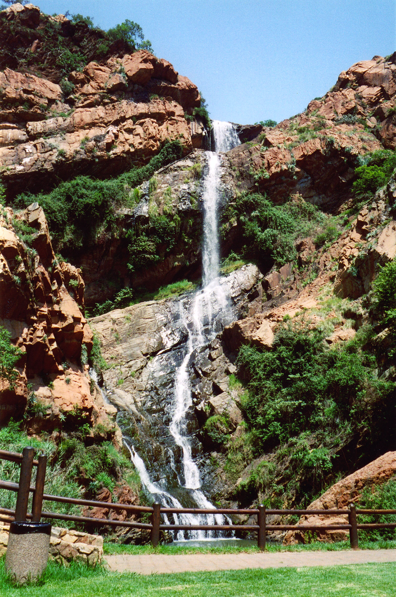

```{r Setup, include = F}
options(htmltools.dir.version = FALSE)
library(pacman)
p_load(leaflet, ggplot2, ggthemes, viridis, dplyr, magrittr, knitr,pagedown,cowplot,latex2exp,gg3D)

rootdir <- ("~/Dropbox/Teaching/UCSB/EDS_222/EDS222_data")
source(file.path(rootdir,"labs","_common.R"))

# Define pink color
red_pink <- "#e64173"
# Notes directory
dir_slides <- "~/Dropbox/Teaching/UCSB/EDS_222/EDS222_code/EDS-222-stats/slides/08-kriging/"
# Knitr options
opts_chunk$set(
  comment = "#>",
  fig.align = "center",
  fig.height = 7,
  fig.width = 10.5,
  # dpi = 300,
  # cache = T,
  warning = F,
  message = F,
  dev = "svg"
)
# A blank theme for ggplot
theme_empty <- theme_bw() + theme(
  line = element_blank(),
  rect = element_blank(),
  strip.text = element_blank(),
  axis.text = element_blank(),
  plot.title = element_blank(),
  axis.title = element_blank(),
  plot.margin = structure(c(0, 0, -1, -1), unit = "lines", valid.unit = 3L, class = "unit"),
  legend.position = "none"
)
theme_simple <- theme_bw() + theme(
  line = element_blank(),
  panel.grid = element_blank(),
  rect = element_blank(),
  strip.text = element_blank(),
  axis.text.x = element_text(size = 14),
  axis.text.y = element_blank(),
  axis.ticks = element_blank(),
  plot.title = element_blank(),
  axis.title = element_blank(),
  # plot.margin = structure(c(0, 0, -1, -1), unit = "lines", valid.unit = 3L, class = "unit"),
  legend.position = "none"
)
```

```{css, echo = FALSE}
@media print {
  .has-continuation {
    display: block;
  }
}
```

# Announcements/check-in

- **Change in office hours** today 1:30pm-2:30pm (by appointment) in Bren Hall 4327

--

- **Remote class** 11/23 (recorded), **no class** 11/25


---
name: Overview

# Today

#### Refresher: types of spatial data
Vectors/objects, rasters/fields

--

#### A common challenge: spatial interpolation
Sample vs. population, points to fields

--

#### Kriging: a powerful form of interpolation
Variogram, kriging

---
layout: false
class: clear, middle, inverse
# Types of spatial data
---
# Spatial data

## Spatial Data can generally split into:

- .hi[Vector] Data
--
: points, lines, and polygons.

--

- .hi[Raster] Data
--
: a grid of equally sized rectangles.
--


An **alternative framing**: <i>object view</i> versus <i>field view</i> 
--

- .pink[**Object View**]: The study region (and world) is a series of entities located in space.

--

Examples
--

: Points representing cities. Non-continuous polygons representing cities.
--

- .pink[**Field View**]: Every location within the study region (and world) has a measurable value.

--

Examples
--

: Elevation. Temperature. Wind direction.

---
# Spatial data

.hi[Q]: Is there a <i>best</i> data type to represent objects or fields?

--

.hi[A]: Usually, but it depends. 


```{R, v_vs_r, out.width = "30%", echo = F}
include_graphics("Vector_vs_raster.jpg")
```

--

- Usually it will be easier to represent .pink[**objects**] with .hi[vector data] and .pink[**fields**] with .hi[raster] data, but ultimately this depends on what analysis you want to run

--

- Luckily, `R` makes it easy to switch back and forth (but we need to be careful and intentional when transforming!)

---
layout: false
class: clear, middle, inverse
# Spatial interpolation

---
# Spatial interpolation

### In environmental data science, we are **often interested in modeling fields**


```{R, wildfire, out.width = "40%", echo = F}
include_graphics("wildfirerisk.png")
```

---
# Spatial interpolation

### But we are doing **statistics!**

--

That means we only have data from a _sample_, not a census of the _population_

```{R, sample, out.width = "85%", echo = F}
include_graphics("raster_vs_sample.png")
```

---
# Spatial interpolation

- Samples taken from a continuous spatial field often raise the need for **spatial interpolation**

--

#### Definition:
#### Spatial interpolation is the process of using a **sample** of observed points to estimate values for **all locations** in a study region

--

For example:
  + Predicting "gold grades" across South Africa using a few borehole samples (the problem of Daniel _Krige_!)
  + Predicting depth to groundwater across California using monitoring wells
  + Predicting air pollution across China using monitoring stations
  + ??

---
# Spatial interpolation in math

- Let $Z(x_0)$ indicate the value (e.g., elevation) at a location $x_0$ that was _not_ sampled

--

- Let $Z(x_i)$ for $i=1,...m$ indicate the values for locations $i=1,...,m$ that _were_ sampled

--

**Spatial interpolation** aims to predict $Z(x_0)$ using a linear combination of the values in the sampled locations:

$$\hat Z(x_0) = \sum_{i=1}^m \lambda_i Z(x_i)$$
where $\lambda_i$ are weights applied to each sampled location.

--

- All spatial interpolation methods assume or derive a set of $\lambda$'s to compute $\hat Z$'s

---
# Interpolation in pictures

```{R, interpvisual, out.width = "80%", echo = F}
include_graphics("spatialinterp_picture.png")
```


---
# Interpolation in one dimension

Consider one-dimensional space where values $y$ depend on location $x$ 

```{r, fig.height=2, echo=FALSE}
set.seed(1234)
x = runif(100, min = 0, max = 100)
z = 10 + sin(.1*x) + .5*rnorm(100)
data = data.frame(x,z)
ggplot(data = data, aes(x,z)) + geom_point(color="seagreen", size=2.5) + 
  theme_bw() + theme(
  line = element_blank(),
  panel.grid = element_blank(),
  rect = element_blank(),
  strip.text = element_blank(),
  axis.text.x = element_text(size = 14),
  axis.text.y = element_text(size = 14),
  legend.position = "none")
```

---
# Interpolation in one dimension

Consider one-dimensional space where values $z$ depend on location $x$ 

```{r,  fig.height=2,  echo=FALSE}
ggplot(data = data, aes(x,z)) + geom_point(color="seagreen", size=2.5) + 
  geom_smooth(method = lm, formula = y ~ poly(x,8), se = FALSE, color = "lightcoral", size=2) + 
  theme_bw() + theme(
  line = element_blank(),
  panel.grid = element_blank(),
  rect = element_blank(),
  strip.text = element_blank(),
  axis.text.x = element_text(size = 14),
  axis.text.y = element_text(size = 14),
  legend.position = "none")
```
---
# Interpolation in two dimensions

Often we have data for an outcome $z$ observed in 2-D space: $z(x, y)$

--

```{r}
include_graphics("raster_vs_sample.png")
```

---
# Interpolation methods

## Polynomial regression


- In one-dimensional space:

$$ \hat Z(x_0) = \hat\beta_0 + \hat\beta_1x_0 + \hat\beta_2x_0^2 + ... + \hat\beta^px_0^p $$
- In two-dimensional space with $(x_{0},y_0)$ the unknown location: 

$$ \hat Z(x_0,y_0) = \hat\beta_0 + \hat\beta_1x_0 + \hat\beta_2y_0 + \hat\beta_3x_0y_0 + \hat\beta_4x_0^2 + \hat\beta_5y_0^2 + ... $$

--

- **Pros:** Easy, analytical expression, continuous & differentiable surface
- **Cons:** Errors can be large, _inexact_

--

**Exact:** Predicts a value identical to the measured value.

--

**Inexact:** Does _not_ predict a value identical to the measured value.

---
# Polynomial regression interpolation 

This is just **multiple linear regression** using spatial information as the independent variables

```{r, echo =T, results='hide'}
mod = lm(z~poly(x,8))
predictions = augment(mod)$.fitted
```

```{r, fig.height=0.25, echo=FALSE}
ggplot(data = data, aes(x,z)) + geom_point(color="seagreen", size=2.5) + 
  geom_smooth(method = lm, formula = y ~ poly(x,8), se = FALSE, color = "lightcoral", size=2) + 
  theme_bw() + theme(
  line = element_blank(),
  panel.grid = element_blank(),
  rect = element_blank(),
  strip.text = element_blank(),
  axis.text.x = element_text(size = 14),
  axis.text.y = element_text(size = 14),
  legend.position = "none")
```

---
# Interpolation methods

## Nearest Neighbors (NN) 

--

- Simple: Assign value of nearest observation in space

--

```{R, nn, out.width = "85%", echo = F}
include_graphics("theissen.png")
```

--

- Creates what are called "Theissen Polygons", which allocate space to the nearest sampled point

---
# Nearest Neighbor interpolation

.hi[Q:] What would the weight vector $\lambda$ look like for NN interpolation?

--

.hi[Q:] What type of function does NN interpolation produce for 1-D space? [draw it!]

--

- **Pros:** Easy, intuitive, field may actually be discontinuous, exact
- **Cons:** Discontinuous, error-prone if field is smooth

--

#### Implementation in `R`

- Easy with the `voronoi()` function from the `dismo` package:

```{r,echo=TRUE,eval=FALSE}
library(dismo)
v <- voronoi(dta)
plot(v)
```

--

- Helpful tutorial [here](https://rspatial.org/raster/analysis/4-interpolation.html)

---
# Interpolation methods 

## Inverse distance weighting

Basic idea: weights are a decreasing function of distance from $x_0$ to $x_i$ 

--

$$\hat Z(x_0) = \sum_{i=1}^m \frac{Z(x_i)Dist(x_i,x_0)^{-p}}{\sum_{i=1}^m Dist(x_i,x_0)^{-p}}$$

Equivalently:

$$\lambda_i^{IDW} = \frac{1/Dist(x_i,x_0)^p}{\sum_{i=1}^m 1/Dist(x_i,x_0)^p}$$ 

where $p$ is the "power parameter" determining how fast the weight declines as the distance between the points grows larger  

---
# Interpolation methods 

## Inverse distance weighting

- **Pros:** Smooth, exact
- **Cons:** Difficult/computationally intensive (you need to compute distances for _all_ pairs of points in the region!), all sampled observations influence $\hat Z(x_0)$, have to choose $p$ somehow, result can be "clumpy"

--

```{R, idw, out.width = "75%", echo = F}
include_graphics("idw.png")
```

---
# Interpolation methods 

## Inverse distance weighting

#### Implementation in `R` 

```{r, echo=T, eval=F}
library(phylin)
idw(values, coords, grid, method = "Shepard", p = 2, R = 2, N = 15,
    distFUN = geo.dist, ...)
```

- Note the `method` argument: "Shepard" follows the math on the previous slide
- Note the `p` argument: Need to specify power parameter

---
# Interpolation methods

## There are many more! 

- Piecewise linear interpolation / Delany triangulation
- Local polynomial regression
- Radial basis function (RBF)
- Kriging (of many forms)
- Many new machine-learning based methods
- Learn more in [Li and Heap (2014)](https://doi.org/10.1016/j.envsoft.2013.12.008)

<!-- ---
- Polynomial 
- Nearest neighbor / Theissen polygons
- Inverse distance weighting
- Piecewise linear / Delany triangulation
- KRIGING
-->

---
# Enter: Kriging

### Kriging is the most widely used form of spatial interpolation in spatial statistics.

--

### Why? 
- It is _flexible_ (i.e., less researcher decisions, more data-driven)
- Under certain assumptions it is the "best linear unbiased estimate" (sound like OLS yet??)
- You can recover an estimate _and_ a standard error (i.e., it is _stochastic_)

#### Next up: Kriging details!

---
layout: false
class: clear, middle, inverse
# Kriging

---
# Kriging: an origin story

The Witwatersrand ("Rand") in South Africa is known for its gold content. Mining engineers wanted to know where in the Rand was most likely to have a high gold content per block of ore. 

.pull-left[
```{R, samap, out.width = "100%", echo = F}
include_graphics("samap.jpeg")
```
]

.pull-right[
```{R, rand, out.width = "60%", echo = F}

```
]
---
# Kriging: an origin story

- Many individual ore samples have been taken (**vector** data -- points)
- Underlying data is the content of the rock (**raster** data -- field)

--

**Spatial interpolation** is highly valuable!

--

- **Danie Krige's solution:** [in his master's thesis!]
  + Use an estimator that minimizes the **mean squared prediction error** (very similar to OLS)
  + Show that it has a bunch of nice properties relative to other forms of spatial interpolation

```{R, krige, out.width = "60%", echo = F}
include_graphics("krige.png")
```
---
# Correlations in space

.hi[Q:] If there is **no correlation** between values in nearby locations, can we predict new values based on our sample? 

.pull-left[
```{R, zcorr, out.width = "100%", echo = F}
include_graphics("zerocorr.png")
```
]

.pull-right[
- Blue = low gold content; Red = high gold content
- **Zero** correlation between values in nearby locations
- Can you predict the gold content in location A based on this sample? 
]

---
# Correlations in space

.hi[Q:] If there is **no correlation** between values in nearby locations, can we predict new values based on our sample? 

.pull-left[
```{R, poscorr, out.width = "100%", echo = F}
include_graphics("poscorr.png")
```
]

.pull-right[
- Blue = low gold content; Red = high gold content
- **Positive** correlation between values in nearby locations
- Now can you predict the gold content in location A based on _this_ sample? 
- _Why?_
]
---
# Variogram

#### Key takeaway: quantifying spatial dependence is key to spatial interpolation

--

A **variogram** describes spatial dependence:

--

> A **variogram** shows the variance of values within groups of observations as a function of the _distance_ between them

--

**Key concept:** Variograms give us a way of understanding how correlated spatial observations are to those around them, and how that correlation “decays” as points get further apart 

--

**Mining example:** Variogram gives a measure of how much two samples taken from the mining area will vary in gold percentage depending on the distance between the samples. Samples farther apart will vary more than those taken close together.

---
# Variogram

Let $Z(x)$ be the value at location x, and $Z(x+h)$ be the value at a location $h$ units away from $x$. 

--

**Variogram:**
$$2\gamma(x+h,x)=var(Z(x+h)-Z(x))$$
--

We often discuss the **semi-variogram**, which is:

$$\gamma(x+h,x) = \frac{1}{2}var(Z(x+h)-Z(x))$$ 

--

Why? Recall:

$$var(a-b) = var(a) + var(b) - 2cov(a,b)$$
So, for a "stationary" variogram, we have $\gamma(x+h,x) = var(Z(x))-cov(Z(x),Z(x+h))$


---
# Variogram: in pictures

```{R, bvgram, out.width = "70%", echo = F}
include_graphics("basic_variogram.png")
```

--

- **Nugget:** At $h=0$, residual variance is from microscale effects or measurement error
- **Sill:** The stationary maximum variance -- no more covariance 
- **Range:** Separation distance beyond which there is no covariance 

---
# Estimating a (semi)variogram

### Empirical semivariogram

$$\hat\gamma(h \pm \delta) = \frac{1}{2N(h\pm\delta)} \sum_{(i,j)\in N(h\pm\delta)} |z_i - z_j|^2$$ 
--

Why? 
- You probably don't have many samples _exactly_ $h$ units apart

--

How? 

- Draw "donuts" of width $\delta$ and average distance $h$ around each point
- Compute differences in values for each pair of points, square them
- Take an average! 

---
# Empirical variogram example

- Bohling's _Introduction to Geostatistics and Variogram Analysis_
- Porosity values in a bean field
- 85 wells sampled

```{R, poros, out.width = "60%", echo = F}
include_graphics("porosity.png")
```

---
# Empirical variogram example

For various values of $h$ and a fixed $\delta$, compute semivariance:

```{R, semiv, out.width = "100%", echo = F}
include_graphics("semivariances.png")
```

---
# Empirical variogram example

**Plot** your semivariances:

```{R, evgram, out.width = "50%", echo = F}
include_graphics("empiricalvariogram.png")
```

---
# Empirical variogram example

Then choose (or optimize) a **variogram model** to fit through the semivariance points:
  + Exponential
  + Spherical
  + Gaussian
  + ...
  
--

**Many more details** on variograms [here](https://www.sciencedirect.com/topics/mathematics/variogram) or in any geostatistics textbook (e.g., Cressie and Wikle, 2011)

---
# Back to kriging

Recall that our goal is a prediction of a value $\hat Z(x_0)$ based on observations in all sampled locations: 

$$\hat Z(x_0)=\sum_i^m \lambda_iZ(x_i)$$


--

In **kriging** (and many spatial interpolation methods), the $\lambda_i$ weights **decay** as distance between $x_0$ and $x_i$ grows larger

-- 

> How do we find the weights in kriging?

---
# Kriging weights

> How do we find the weights in kriging?

--

### Hint:

```{R, bvgram2, out.width = "60%", echo = F}
include_graphics("basic_variogram.png")
```

The **variogram** tells us how correlated values are with other values near them, and how this correlation falls as distance grows. It is a **key input** into the kriging solution.

---
# Deriving the kriging solution

Note: full derivation in Cressie and Wikle (2011) [this is a very shorthand version]

#### Goal: minimize mean squared prediction error

$$min_\lambda \hskip2mm E[ (Z(x_0)-\sum_i^m \lambda_i Z(x_i))^2 ]\hskip2mm \text{subject to}\hskip2mm \sum_i^m \lambda_i = 1$$
--

To solve: 

1. Take derivatives with respect to each $\lambda_i$
2. Set each first order condition = 0
3. Solve system of equations for $\lambda_i^*$ values that minimize mean squared error

---
# Deriving the kriging solution

### Result:

$$\hat Z(x_0) = \underbrace{\{\mathbf{\tilde\gamma}(x_0) + \mathbf{1}(1-\mathbf{1}'\mathbf{\Gamma}_Z^{-1}\mathbf{\tilde\gamma}(x_0))/(\mathbf{1}'\mathbf{\Gamma}_Z^{-1}\mathbf{1})\}'\mathbf{\Gamma}_Z^{-1}}_{\hat\lambda}Z$$
- where $\mathbf{\tilde\gamma}(x_0)$ is the vector containing the semivariogram evaluated between $x_0$ and every other point, and 

- $\mathbf{\Gamma}_Z$ is the $m\times m$ matrix containing all semivariogram evaluations for all sampled point pairs.

--

- See Cressie and Wikle (2011) for similar derivation for $\sigma^2(x_0)$, an estimate of the prediction error

--

Other helpful resources [here](https://www.publichealth.columbia.edu/research/population-health-methods/kriging-interpolation)

---
# Forms of kriging

There are **three** main forms of kriging:

--

1. **Simple:** The mean of the entire field is **constant** and **known** [restrictive, not usually realistic]

--

2. **Ordinary:** The mean of the entire field is **constant** but **unknown** [derivation shown above; most common]

--

3. **Universal:** The mean of the field varies over space and can be estimated using measured variables [requires knowledge of and reason for trend in mean]

--

- There are also other forms! E.g., quantile kriging, log-normal kriging, IRFk-kriging, etc.

--

- We will work on implementation in `R` in the next lab.

---
# Forms of kriging

```{R, lebrenz, out.width = "60%", echo = F}
include_graphics("hess-23-1633-2019-f07-thumb.png")
```

_Source: Lebrenz and Bardossy (2019)_

---
# Kriging summary

#### Pros:
- Under each set of assumptions specific to the kriging form, kriging is the best linear unbiased predictor ("BLUP")
- Weights are determined almost entirely by the data, instead of a-priori assumptions 
- Exact
- Provides a measure of precision: $\sigma^2(x_0)$

--

#### Cons:
- Nonlinear methods may perform better (e.g., [ML methods](https://doi.org/10.1016/j.envsoft.2013.12.008))
- Variogram has to be approximated/estimated
- Complex/computationally intensive

---
# A note of caution on interpolation

#### All spatial interpolation approaches work best if:

- The observed data are relatively **dense and well distributed** throughout the region of interest

--

- You have a lot of observations

--

#### All spatial interpolation approaches should be used cautiously, especially if: 

--

- You have **highly clustered** data with a lot of open space between them

--

- You don’t have very many observations

---

class: center, middle


Slides created via the R package [**xaringan**](https://github.com/yihui/xaringan).

---
exclude: true

```{css, echo = FALSE}
@media print {
  .has-continuation {
    display: block;
  }
}
```

```{R, printpdfs, echo = F, eval = F}
pagedown::chrome_print(
  input = "08-kriging.html",
  output = "08-kriging.pdf",
  timeout = 60
)
```
